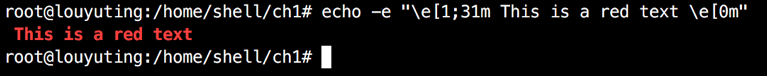
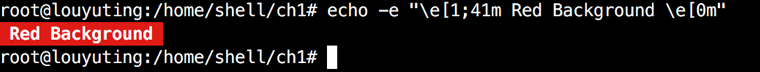

# 【shell】笔记


# 1. 控制台彩色打印
每种颜色都有对应的色码：
    重置=0；
    黑色=30；
    红色=31；
    绿色=32；
    黄色=33；
    蓝色=34；
    洋红=35；
    青色=36；
    白色=37.

### 打印彩色文本：
`echo -e "\e[1;31m This is a red text \e[0m”`

输出是：




上面 \e[1;31m 将颜色设置成红色； \e[0m 将颜色重置。

### 打印彩色背景色：
    重置=0；
    黑色=40；
    红色=41；
    绿色=42；
    黄色=43；
    蓝色=44；
    洋红=45；
    青色=46；
    白色=47.





# 2.算数运算的方式
Bash环境中执行基本的算数操作的方式有：
    1）let、
    2）(( ))
    3）[ ]
    4）高级操作有：expr 和 bc 这两个工具

上面的 1、2、3和expr只支持整数，不支持浮点。
bc 操作支持浮点数。

# 3. 文件描述符和重定向
0- 标准输入
1- 标准输出 （默认的）
2- 标准错误   (命令是错误的会输出标准错误)
```
echo “hello world!” > log.log    # 这种形式会先将log.log清空，再写入

echo “hello world!” >> log.log   # 这种形式会以在目标文件的末尾追加的方式写入
```

其实： >  等同于  1>
           >> 等同于 1>>

### 输出
比如：
```
ls +>> test.txt
# 这个命令的错误输出不会加到 test.txt 这个文件中，因为默认只重定向到 test.txt 这个文件中。

# 这个时候应该是： 
ls + 2>> test.txt
# 这样错误输出才会添加到 test.txt 这个文件中。

command  2>>stderr.txt  1>>stdout.txt
# 将错误输出和标准输出分别输出到不同文件中

cmd &>output.txt
# 所有输出都输出到一个文件。
```

# shell-read命令—写交互式脚本
[shell—read命令 - li0924 - 博客园](http://www.cnblogs.com/lottu/p/3962921.html)
http://www.cnblogs.com/lottu/p/3962921.html


