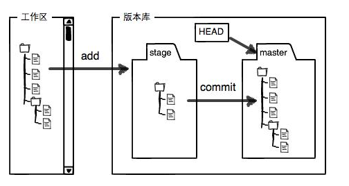

# 【git】版本回滚


# 版本回滚与仓库信息
# 1  工作区状态
 `git status`   命令可以让我们时刻掌握仓库当前的状态。

 `git diff`  顾名思义就是查看difference，显示的格式正是Unix通用的diff格式。


# 2 版本回退
Git提供这样功能：当我们觉得文件修改到一定程度的时候，就可以“保存一个快照”，这个快照在Git中被称为commit。一旦你把文件改乱了，或者误删了文件，还可以从最近的一个commit恢复，然后继续工作，而不是把几个月的工作成果全部丢失。

查看commit记录的命令：
`git log`

以下显示的是一个运行示例：


git log命令显示从最近到最远的提交日志，如果觉得log信息太多，可以使用：

`git log --pretty=oneline`

如下：只显示了commit id 和 备注内容：


上面看到的前面一大串类似 354bdae2dc3…….ad4b5a9d982745a9 字符串是 commit id （版本号）。在Git中，用HEAD表示当前版本，也就是最新的提交354bdae2dc3…….ad4b5a9d982745a9（注意我的提交ID和你的肯定不一样），上一个版本就是HEAD^，上上一个版本就是HEAD^^，当然往上100个版本写100个^比较容易数不过来，所以写成HEAD~100。

需求：把当前版本“append GPL”回退到上一个版本，就可以使用git reset命令：
```
git reset --hard HEAD^
```

这个时候我已经回退到上一个版本了，如果我想再恢复到回退前的版本怎么办呢？ 其实也可以解决，只要当前命令行窗口没被关掉，执行命令：
```
git reset --hard <commit id>
```

如果要回退到某个指定的版本：
```
# git reset --hard <commit id>， 这里的commit id 可以不写全，但是不能太少，太少就存在重复可能性。比如下图：
git reset --hard 354bdae2dc3……
```

版本回退速度非常快，因为Git在内部有个指向当前版本的HEAD指针，当你回退版本的时候，Git仅仅是把HEAD从指向append GPL：


现在，你回退到了某个版本，关掉了电脑，第二天早上就后悔了，想恢复到新版本怎么办？找不到新版本的commit id怎么办？

在Git中，总是有后悔药可以吃的。当你用 `$ git reset --hard HEAD^` 回退到add distributed版本时，再想恢复到append GPL，就必须找到append GPL的commit id。Git提供了一个命令`git reflog`用来记录你的每一次命令，比如如下图示例：

```
$ git reflog
ea34578 HEAD@{0}: reset: moving to HEAD^
3628164 HEAD@{1}: commit: append GPL
ea34578 HEAD@{2}: commit: add distributed
cb926e7 HEAD@{3}: commit (initial): wrote a readme file
```

终于舒了口气，第二行显示append GPL的commit id是3628164，现在，你又可以乘坐时光机（git reset --hard <commit id>）回到未来了。

# 3 工作区和暂存区：



前面讲了我们把文件往Git版本库里添加的时候，是分两步执行的：

第一步是用git add把文件添加进去，实际上就是把文件修改添加到暂存区；
第二步是用git commit提交更改，实际上就是把暂存区的所有内容提交到当前分支。

因为我们创建Git版本库时，Git自动为我们创建了唯一一个master分支，所以，现在，git commit就是往master分支上提交更改。你可以简单理解为，需要提交的文件修改通通放到暂存区，然后，一次性提交暂存区的所有修改。

简单点说，没有git add的文件，就不会被 tracked, commit的时候就不会被添加到仓库。

# 4 撤销修改
```
# git checkout -- filename  可以丢弃工作区的修改，比如：
git checkout -- readme.md
```
命令`git checkout -- readme.txt`意思就是，把readme.txt文件在工作区的修改全部撤销，这里有两种情况：
	1）一种是readme.txt自修改后还没有被放到暂存区，现在，撤销修改就回到和版本库一模一样的状态；
	2）一种是readme.txt已经添加到暂存区后，又作了修改，现在，撤销修改就回到添加到暂存区后的状态。

总之，就是让这个文件回到最近一次git commit或git add时的状态。 这里一定要注意，命令中的 `--`一定要写，不然就是切换分支的命令了。

背景：写错了一些文档内容，并且也add 到了暂存区（stage）,这时候要撤销，怎么办呢？我们用git status 查看一下就可以发现有提示：
```
$ git status
# On branch master
# Changes to be committed:
#   (use "git reset HEAD <file>..." to unstage)
#
#       modified:   readme.txt
#
```

用命令`git reset HEAD filename`可以把暂存区的修改撤销掉（unstage），重新放回工作区， 这里用HEAD表示最新的版本。

总结：
1. 撤销工作区的修改： `git checkout -- filename`
2. 撤销暂存区的修改，修改返回工作区：`git reset  HEAD filename`， 如果这是工作区也不想要，再执行`git checkout -- filename`
3. 已经提交了不合适的修改到版本库时，想要撤销本次提交，参考版本回退一节，不过前提是没有推送到远程库。

# 5 查看分支合并图
`git log --graph`


