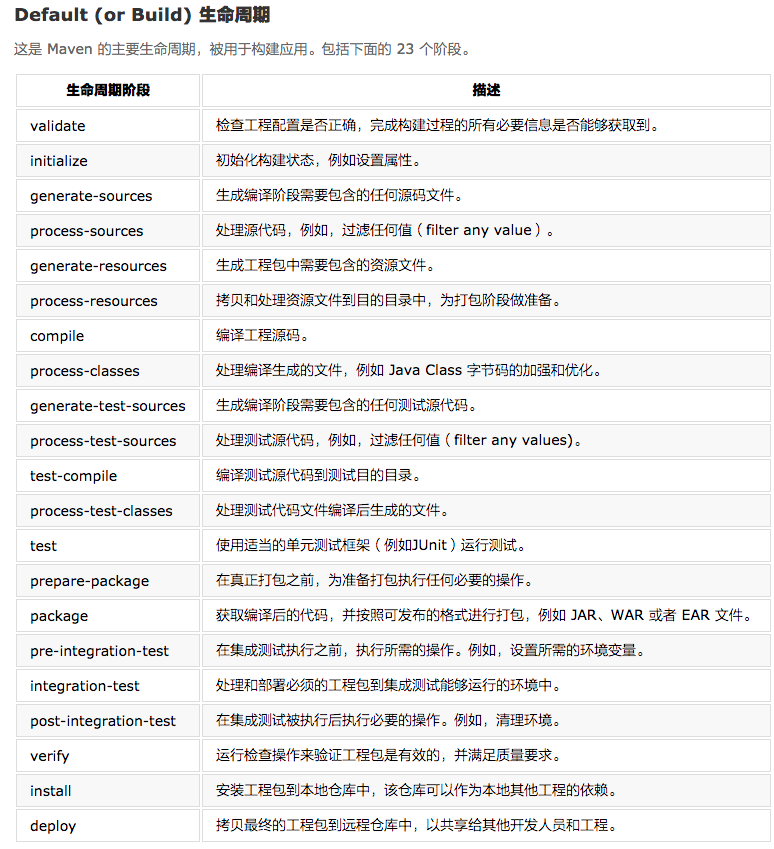

# 【maven】详解

#技术积累/工具/maven

# 1. Maven - POM
能够在 POM 中设置的一些配置如下：

1. project dependencies
2. plugins
3. goals
4. build profiles
5. project version
6. developers
7. mailing list

POM 举例：


# 2. maven的构建生命周期

一个典型的maven构建生命周期通常是由以下几个阶段组成的：


下面是maven项目构建的整个生命周期：




关于Maven的生命周期，有一些重要的概念要说明：

> 当一个阶段通过 Maven 命令调用时，例如 mvn compile，只有该阶段之前以及包括该阶段在内的所有阶段会被执行。  
>
> 不同的 maven 目标将根据打包的类型(JAR / WAR / EAR)，被绑定到不同的 Maven 生命周期阶段。  

# 3. Maven 构建配置文件
构建配置文件是一组配置的集合，用来设置或者覆盖 Maven 构建的默认配置。使用构建配置文件，可以为不同 的环境定制构建过程，例如 Producation 和 Development 环境。


# 4. Maven的仓库
## 基础概念
在 Maven 的术语中，仓库是一个位置(place)，例如目录，可以存储所有的工程 jar 文件、library jar 文 件、插件或任何其他的工程指定的文件。

Maven 仓库有三种类型:1. 本地(local)：机器上的一个文件夹。它在你第一次运行任何 maven 命令的时候创建。Maven 本地仓库保存你的工程的所有依赖(library jar、plugin jar 等)2. 中央(central) ：Maven 中央仓库是由 Maven 社区提供的仓库，其中包含了大量常用的库。
3. 远程(remote)：Maven 提供了远程仓库的概念，它是开发人员自己定制仓库，包含了所需要的代码库或者其他工程中用到的 jar 文件。一般这个仓库都是每个公司自己的仓库位置。


## Maven 依赖搜索顺序

本地仓库—》中央仓库—》远程仓库


# 5. Maven的插件
## maven插件
Maven 实际上是一个依赖插件执行的框架，每个任务实际上是由插件完成。Maven 插件通常被用来:• 创建 jar 文件• 创建 war 文件• 编译代码文件• 代码单元测试• 创建工程文档• 创建工程报告

插件通常提供了一个目标的集合，并且可以使用下面的语法执行:
`mvn [plugin-name]:[goal-name]`例如，一个 Java 工程可以使用 maven-compiler-plugin 的 compile-goal 编译，使用以下命令:`mvn compiler:compile`


## 插件类型


# 6. Maven创建工程
Maven 使用原型(archetype)插件创建工程。下面给出一个创建工程的命令是实例：

```
mvn archetype:generate -DgroupId=com.companyname.bank -DartifactId=consumerBanking 
-DarchetypeArtifactId=maven-archetype-quickstart -DinteractiveMode=false
```


# 7. maven 构建&测试工程
## 构建
`mvn clean package`

输入以上命令maven就会开始构建工程并生成最终的jar文件：
1. 我们给了 maven 两个目标，首先清理目标目录(clean)，然后打包工程构建的输出为 jar(package)文 件。
2. 打包好的 jar 文件可以在 consumerBanking\target 中获得，名称为 consumerBanking-1.0-SNAPSH OT.jar。
3. 测试报告存放在 consumerBanking\target\surefire-reports 文件夹中。
4. Maven 编译源码文件，以及测试源码文件。
5. 接着 Maven 运行测试用例。
6. 最后 Maven 创建工程包。

# 8. 外部依赖
外部依赖指：某一些包，maven的仓库中没有，比如我们自己打包的项目，这个时候如果想引入项目，怎么解决：
• 在 src 文件夹下添加 lib 文件夹• 复制任何 jar 文件到 lib 文件夹下。我们使用的是 ldapjdk.jar ，它是为 LDAP 操作的一个帮助库、
• 配置pom.xml


	1. 外部依赖(library jar location)能够像其他依赖一样在 pom.xml 中配置。
	2. 指定 groupId 为 library 的名称。
	3. 指定 artifactId 为 library 的名称。
	4. 指定作用域(scope)为系统。
	5.  指定相对于工程位置的系统路径。

# 9. maven工程文档
创建应用程序的文档的方法：

`mvn site`

运行命令之后就会创建文档的html文件。

# 10. maven快照 SNAPSHOT
## 什么是快照？
快照是一个特殊的版本，它表示当前开发的一个副本。与常规版本不同，Maven 为每一次构建从远程仓库中检出 一份新的快照版本。现在数据服务团队会将每次更新的代码的快照(例如 data-service:1.0-SNAPSHOT)发布到仓库中，来替换旧的快照 jar 文件。

## 快照VS版本
对于版本，Maven 一旦下载了指定的版本(例如 data-service:1.0)，它将不会尝试从仓库里再次下载一个新 的 1.0 版本。想要下载新的代码，数据服务版本需要被升级到 1.1。对于快照，每次用户接口团队构建他们的项目时，Maven 将自动获取最新的快照(data-service:1.0-SNAPS HOT)。


# 11. maven的构建自动化
构建自动化定义为一种场景：一旦该工程成功构建完成，其相关的依赖工程即开始构建，目的是为了保证其依赖项目的稳定。

这时候使用持续集成工具是最好的。

# 12. maven依赖管理
Maven 核心特点之一是依赖管理。一旦我们开始处理多模块工程(包含数百个子模块或者子工程)的时候，模块间的依赖关系就变得非常复杂，管理也变得很困难。针对此种情形，Maven 提供了一种高度控制的方法。

## 依赖传递的控制


## 依赖范围
传递依赖发现可以通过使用如下的依赖范围来得到限制，也就是指定包的有效范围，通过<scope>标签来指定。


compile、provided、runtime、test、system、import。

如果没有指定，就会默认使用compile依赖范围。使用此依赖范围的Maven依赖，对于编译、测试、运行三种classpath都有效。

## 依赖管理（父pom）
通常情况下，在一个共通的工程下，有一系列的工程。在这种情况下，我们可以创建一个公共依赖的 pom 文 件，该 pom 包含所有的公共的依赖关系，我们称其为其他子工程 pom 的 pom 父。 接下来的一个例子可以帮助 你更好的理解这个概念。

其实也就是父子 pom 文件。子pom继承于父pom

# maven自动化部署
自动化部署项目到远程服务器：


