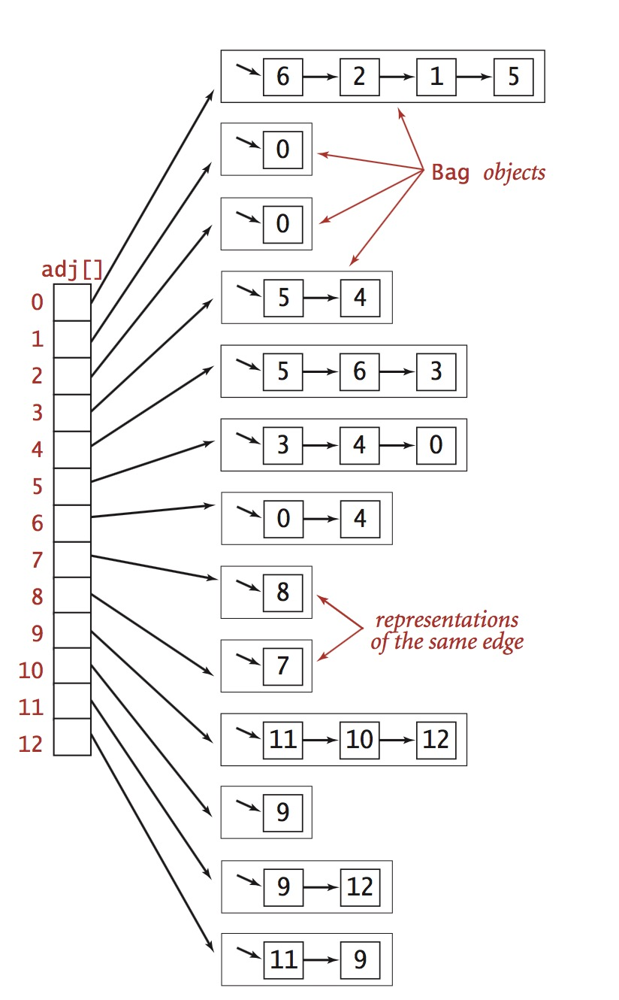

# 无向图


# 一. 无向图相关的常见术语

（1）当两个顶点通过一条边相邻时，我们称这两个==顶点是相邻的==。


（2）某个==顶点的度数==即为依附于它的边的总数。


（3）==子图==：由一幅图的所有边的一个子集(以及所依附的所有顶点的子集)组成的图。


（4）==路径==：由边顺序连接的一系列顶点。


（5）==简单路径==：一条没有重复顶点的路径。


（6）==环==：至少含有一条边，且起点和终点相同的路径。


（7）==简单环==：出了起点和终点外，没有重复顶点和边的环。


（8）==路径或则环的长度==：是其所包含的边的数量。


（9）==连通图==：从任意一个顶点都存在一条路径到达另外一个任意顶点就称这个图是连通图。


（10）==极大连通图==：一个非联通的图由若干连通的部分组成，它们都是极大连通子图。


（11）==无环图==：一张不包含环的图。


（12）==树==：是一张无环连通图。


（13）==图的密度==：已经连接的顶点对 占 所有可能被连接的顶点对的比例。


（14）==稀疏图==：被连接的顶点对很少。


（15）==稠密图==：很少的顶点对没有边连接。


# 二. 无向图的数据类型

要学习图相关的算法，首先我们得定义图的数据结构，以及一份基本的操作的API.

- API 

```java
public Graph(int V) 

public Graph(In in)

public int V()

public int E()
   
public void addEdge(int v, int w)

public Iterable<Integer> adj(int v)
```

## 1. 图的表示方法：数据结构

定义一个图有V个节点，E条边。我们希望有一个数据结构能够完整表示图这种逻辑结构而且满足以下要求：

- 必须为应用中可能碰到的各种图足够节省空间，因为当节点是百万级别时候，必须要节省空间。

- Graph的基本API实现必须要快，因为它们是实现各种算法的基础。

  ​

### （1）邻接矩阵：

用一个V*V的布尔矩阵表示，当顶点v和w相连接的时候，则v行w列的数据时true,否则为false。这种表达方法相当占用内存，有百万节点的图是很常见的，V^2个布尔值占用内存是不能够接受的。


### （2）邻接表数组

使用一个以顶点为索引的List列表数组，其中每个元素都是和该顶点相邻的顶点列表。 该方法能满足上面我们说的两点要求。本文后面我们都会使用这种方式。


###（3）边的数组

我们可以使用一个Edge类表示边，里面有两个整数表示两边的节点。这种方法很简单，但是实现Graph的基本API，比如adj()需要遍历所有的边，很繁琐。也不适合


## 2. 邻接表的数据结构



```java
/**
 * 图的基本API以及物理存储：邻接表实现
 *
 * @author 惜暮
 * @email chris.lyt@cainiao.com
 * @date 2017/11/29
 */
public class Graph {
    /** 图的顶点数目 */
    private final int V;
    /** 图的边的数目 */
    private int E;
    /** 图的邻接表表示形式， Bag是对链表的一个封装 */
    private Bag<Integer>[] adj;

    /**
     * 创建有V各节点，0条边的无向图
     *
     * @param V 图中的节点数
     */
    public Graph(int V) {
        this.V = V;
        this.E = 0;
        /* 创建邻接表 */
        adj = (Bag<Integer>[])new Bag[V];
        for (int i=0; i<V; i++){
            adj[i] = new Bag<>();
        }
    }

    /**
     * 读取文件里面的数据构造一个图
     *
     * @param in 图的数据源
     */
    public Graph(In in){
        this(in.readInt());//第一行是节点数
        int E = in.readInt();//第二行是边的数量
        for(int i=0; i<E; i++){
            int v = in.readInt();
            int w = in.readInt();
            addEdge(v, w);// 连接一条边
        }
    }

    public int V(){
        return this.V;
    }

    public int E(){
        return this.E;
    }

    /**
     * 在节点v 和 节点w之间建立一条边
     *
     * @param v 节点v
     * @param w 节点w
     */
    public void addEdge(int v, int w){
        adj[v].add(w);
        adj[w].add(v);
        E++;
    }

    /**
     * 返回和节点v相邻的所有节点
     *
     * @param v 节点v
     * @return 与节点v相邻的节点的List
     */
    public Iterable<Integer> adj(int v){
        return adj[v];
    }
}
```


## 3. 图的处理算法的设计模式

我们设计图的算法时候，首要目标就是将具体算法的实现和图的表示隔离开，因此，对于不同的图的算法，会穿件一个独立的类。


除了前面的基本图的结构，我们新增关于search的API

```java
public interface Search{
  	Search(Graph G, int s);//找到和起点S连通的所有顶点
    boolean marked(int v);// v和s是连通的吗
  	int count();//与s连通的所有顶点数
}
```


# 三. 深度优先搜索(DFS)

代码见源码文件工程-javamaven

```java
package com.example.algorithm4.graphs;

/**
 * <p>DFS 深度优先遍历</p>
 * <p>此算法有个缺点：对于有E条边的图，算法需要需要遍历2E次边。也就是每条边被访问两次，比如：
 * 对于v-w的边，第一次访问时，v已被标记，w被标记已访问，当从w-v时，也要访问一次，只不过会判断v已经被
 * 访问过了，所以return.
 *
 * @author 惜暮
 * @email chris.lyt@cainiao.com
 * @date 2017/11/30
 */
public class DepthFirstSearch {
    /**
     * 节点是否被访问过，比如从v-w 这个，如果w已经被访问过了，那么marked[w]就是true
     */
    private boolean[] marked;
    /**
     * 访问的节点数
     */
    private int count;

    /**
     * DFS的构造器
     *
     * @param graph 进行深度优先遍历的图
     * @param s 深度优先遍历的起始节点
     */
    public DepthFirstSearch(Graph graph, int s) {
        this.marked = new boolean[graph.V()];
        dfs(graph, s);
    }

    /**
     * 从图的节点 v 开始进行DFS
     *
     * @param graph 图
     * @param v 开始DFS的起点
     */
    private void dfs(Graph graph, int v){
        marked[v] = true;
        count++;
        for (int w : graph.adj(v)){
            //遍历节点V的所有未访问过的相邻节点
            if(!marked[w]){
                dfs(graph, w);
            }
        }
    }

    /**
     * 判断节点w是否已经被标记
     *
     * @param w 图的节点
     * @return 节点w已经被标记，返回true，否则返回false。
     */
    public boolean marked(int w){
        return marked[w];
    }

    /**
     * 返回总的路径长度
     * @return
     */
    public int count(){
        return count;
    }
}
```


其实很多实际问题都是基于DFS解决的，比如：

- 给定一幅图，判断两个顶点是否是连通的；
- 或则判断一幅图中有多少个连通子图。

这类问题其实也就是路径检测，检测图中是否存在一条从节点A到节点B的路径。这种应用特别多，比如对于社交网络里面的好友关注关系，判断两个人是否是好友，直接通过图的DFS算法进行路径检测就可以得出。


# 四. 寻找路径

单点路径问题在图的算法领域十分常见，我们可以给出如下API设计：

|       Public interface Paths        |                      |
| :---------------------------------: | :------------------: |
|     Paths(Graph graph, int s);      |   在图G中找出所有起点为s的路径    |
|      boolean hasPathTo(int v);      |   是否存在从节点s到节点v的路径    |
| ` Iterable<Integer> pathTo(int v);` | 求s到v的路径，如果不存在就返回null |


# 五. 广度优先搜索(BFS)


# 六. 连通分量


# 七. 符号图


# 八. 总结


