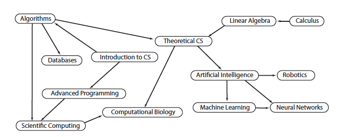
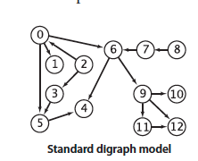
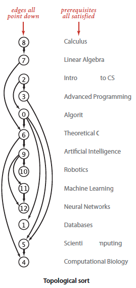
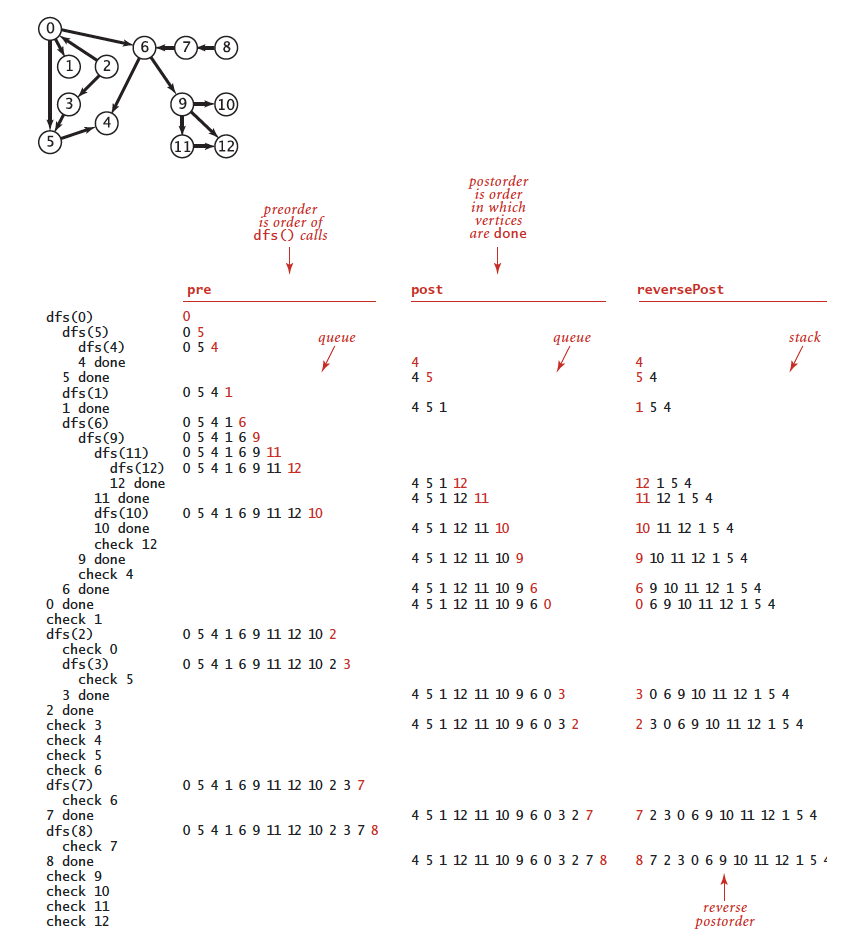
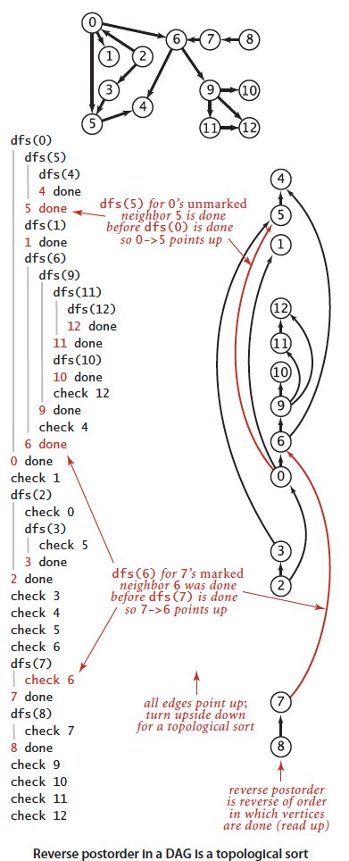

# 有向图

# 一. 有向图的相关术语

在有向图中，边是单向的：每条边连接的两个顶点都是一个有序对，它们的邻接性是单向的。我们开发过程中碰到的很多场景都是有向图：比如任务調度的依赖关系，社交网络的任务关系等等都是天然的有向图。


**以下概念都是针对有向图的：**

（1）==有向图==：一幅有向图是由一组顶点和一组有方向的边组成的，每条有方向的边都连接着有序的一对顶点。


（2）==顶点的出度==：该顶点指出的边的总数。


（3）==顶点的入度==：指向该顶点的边的总数。


（4）比如对于有序对(w,v) 一般代表w->v 的一条有向边。


（5）==有向路径==：由一系列顶点组成，其中每个顶点都存在一条有向边从它指向序列中的下一个顶点。


（6）==有向环==：为一条至少含有一条边且起点和终点相同的有向路径。


（7）==简单有向环==：是一条除了起点和终点外，不含有重复的顶点和边的环。


# 二. 有向图的存储数据结构

首先定义有向图的API接口，DiGraph 本质上和Graph是一样的。

|     public class Digraph     |                      |
| :--------------------------: | :------------------: |
|        Digraph(int v)        | 创建一副含有v个顶点，但是没有边的有向图 |
|        Digraph(In in)        |     从输入流中读取一副有向图     |
|           int E()            |         边的总数         |
|           int V()            |         边的总数         |
|  void addEdge(int v, int w)  |     添加一条有向边v ->w     |
| `Iterble<Integer>adj(int v)` |  由顶点v出发的有向边所连接的所有顶点  |
|      Digraph reverse()       |        该图的反向图        |
|      String toString()       |      对象的字符串表示形式      |


## 1. 有向图的表示

原因和无向图的表示类似，我们还是使用邻接表来存储有向图，其中边 v—>w 表示为顶点v所对应的邻接链表中包含一个w顶点。


## 2. 有向图取反

上面的API中给出了reverse() 方法，将有向图中的所有有向边反转，并生成副本。


## 3. 有向图的实现

还是使用邻接表来存储有向图，用数组来表示图中的每个节点的集合，并且数组的下标就表示节点的标识符。

下面就是有向图的实现方式：


```java
package com.example.algorithm4.graphs;

import edu.princeton.cs.algs4.Bag;

/**
 * 有向图的实现
 *
 * @author 惜暮
 * @email chris.lyt@alibaba-inc.com
 * @date 2017/12/7
 */
public class DiGraph {
    /**
     * 节点的总个数
     */
    private final int V;
    /**
     * 边的总个数
     */
    private int E;
    /**
     * 有向图的邻接表表示法
     */
    private Bag<Integer>[] adj;

    /**
     * 创建一个含有V个节点，但是0条边的有向图
     * @param V
     */
    public DiGraph(int V) {
        this.V = V;
        this.E = 0;
        adj = (Bag<Integer>[])new Bag[V];
        for (int i=0; i<this.V; i++){
            adj[V] = new Bag<>();
        }
    }


    public int E(){
        return this.E;
    }


    public int V(){
        return this.V;
    }

    /**
     * 添加一条 v-->w 的边
     * @param v 有向边的源在数组中的标识符
     * @param w 有向边的终在数组中的标识符
     */
    public void addEgge(int v, int w){
        adj[v].add(w);
        this.E++;
    }

    /**
     * 节点v 的所有出度的终顶点
     * @param v 节点v 的标识符
     * @return
     */
    public Iterable<Integer> adj(int v){
        return adj[v];
    }

    /**
     * 此有向图反转之后的副本
     * @return
     */
    public DiGraph reverse(){
        DiGraph reverse = new DiGraph(this.V);
        for(int i=0 ;i<this.V; i++){
            for (int w : adj[i]){
                //边反转
                reverse.addEgge(w, i);
            }
        }
        return reverse;
    }
}
```


## 4. 符号有向图的实现

有向图的邻接表实现方式和无向图的邻接表实现方式，区别不大，仅仅在于边的处理上有一点区别。如果对于有向图的结点的标识我们也想用字符串来表示呢？其实实现方法和无向图几乎一样，只需要把SymbolGraph中的Graph替换成DiGraph就可，下面也给出实现代码：

```java
package com.example.algorithm4.graphs;

import edu.princeton.cs.algs4.In;
import edu.princeton.cs.algs4.ST;

/**
 * 符号有向图的实现
 * @author 惜暮
 * @email chris.lyt@alibaba-inc.com
 * @date 2017/12/7
 */
public class SymbolDiGraph {
    private ST<String, Integer> st; // 顶点符号名 -> 数组索引
    private String[] keys; // 数组索引 -> 顶点符号名
    private DiGraph G; // 图

    /**
     * 构造一颗符号有向图
     * @param stream 顶点边的数据源
     * @param sp 顶点分隔符
     */
    public SymbolDiGraph(String stream, String sp) {
        st = new ST<>();
        In in = new In(stream); // First pass
        while (in.hasNextLine()) {// builds the index
            String[] a = in.readLine().split(sp); // by reading strings
            for (int i = 0; i < a.length; i++) {// to associate each
                if (!st.contains(a[i])) {// distinct string
                	st.put(a[i], st.size()); // with an index.
                }
            }
        }
        keys = new String[st.size()]; //建立索引 --> 结点符号
        for (String name : st.keys()) {// to get string keys
          	keys[st.get(name)] = name; // is an array.
        }
        G = new DiGraph(st.size());
        in = new In(stream); // Second pass
        while (in.hasNextLine()) {// builds the graph
            String[] a = in.readLine().split(sp); // by connecting the
            int v = st.get(a[0]); // source vertex
            for (int i = 1; i < a.length; i++) {// on each line
            	G.addEdge(v, st.get(a[i])); // to all the others.
            }
        }
    }

  	public boolean contains(String s) {
      	return st.contains(s);
    }

  	public int index(String s) {
      	return st.get(s);
    }

	public String name(int v) {
      	return keys[v];
    }

	public DiGraph G() {
      	return G;
    }
}
```


# 三. 有向图中的可达性

我们在无向图中介绍的第一个算法就是DFS，其实无向图很多算法的基础，解决了单点连通性的问题，可以判断无向图中指定的两个顶点是否连通。其思想对于有向图同样适用~


在有向图中叫做单点可达性：给定一个有向图和一个起点s，判断是否存在一条从起点s到指定节点v的有向路径。


针对以上问题，设计DirectedDFS 算法的API：

|         public class DirectedDFS         |                            |
| :--------------------------------------: | -------------------------- |
|      DirectedDFS(DiGraph G, int s)       | 在G中找到从s可达的所有顶点             |
| `DirectedDFS(DiGraph G, Iterable<Integer> sources)` | 在G中找到从sources的所有顶点中可达的所有顶点 |
|         boolean reachable(int v)         | d顶点v是可达的嘛                  |


## 1. 使用DFS实现有向图的可达性分析

> 在有向图中，深度优先搜索标记由一个集合的顶点可达的所有顶点所需的时间与被标记的所有顶点的出度之和成正比。


下面是有向图的可达性算法的实现：

```java
package com.example.algorithm4.graphs;

/**
 * 有向图的深度优先遍历
 *
 * @author 惜暮
 * @email chris.lyt@alibaba-inc.com
 * @date 2017/12/7
 */
public class DirectedDFS {
    /**
     * 从起点开始DFS访问过的路径标记
     */
    private boolean[] marked;

    public DirectedDFS(Digraph digraph, int s) {
        this.marked = new boolean[digraph.V()];
        dfs(digraph, s);
    }

    public DirectedDFS(Digraph digraph, Iterable<Integer> sources) {
        this.marked = new boolean[digraph.V()];
        for(int s : sources){
            if (!marked[s]){
                dfs(digraph, s);
            }
        }
    }

    /**
     * 从节点v 开始有向图的DFS
     *
     * @param digraph 有向图
     * @param v 结点
     */
    private void dfs(Digraph digraph, int v){
        this.marked[v] = true;
        for (int w : digraph.adj(v)){
            if(!this.marked[w]){
                dfs(digraph, w);
            }
        }
    }

    public boolean marked(int v){
        return marked[v];
    }
}
```


这份深度优先搜索实现能够判断一个或则一组(多点可达性)顶点能到达哪些其他顶点。

## 2. 标记-清除 的垃圾收集

多点可达性的一个重要的实际应用是在典型的内存管理上，比如JVM内存管理，在一幅有向图中，一个顶点代表一个对象，一条边代表一个对象对另外一个对象的引用。 有向图的模型很好的可以应用在JVM内存管理上面。当从根节点遍历时候，那么不可达的顶点就代表不会再被使用，就可以被回收以释放内存。


标记-清除d额垃圾回收算法会为每个对象保存一个位作为垃圾回收之用，然后周期性的运行一个类似于DirectedDFS的有向图可达性算法来标记所有可以被访问到的对象，然后清理所有对象，回收没有被标记的对象，以达到释放内存的目的。

## 3. 有向图的寻路

DepthFirstPaths 和 BreadthFirstPaths 也都是有向图处理中的重要算法。可以用处理下面问题：

- 单点有向路径：给定一个起点s，从s到给定目的顶点v是否存在一条有向路径。如果有就找出这条路径。
- 单点最短有向路径：给定一个起点s，从s到给定目的顶点v是否存在一条有向路径。如果有就找出最短的路径。


下图给出了一个使用深度优先遍历在一幅有向图中寻找能够从顶点0到达的所有顶点的轨迹 的示意图：


# 四. 环和有向无环图

在有向图的实际应用中对于有向环的检测十分重要，因为有向环就代表着死循环，然后实际的项目中由于依赖关系的复杂，几乎不可能肉眼检测有向环，所以检测有向环是否存在就至关重要。


下面从实际案例来分析有向环。

## 1. 调度问题

一个广泛使用的模型就是给定一组任务并安排它们的执行顺序，**限制条件是这些任务的执行方法和起始时间。限制条件可能还包括任务的耗时以及消耗的其他资源。最重要的一种限制条件叫做优先级限制，它指明了哪些任务必须在哪些任务之前完成。**  不同类型的限制条件会产生不同类型不同难度的调度问题

 

下面以一个正在安排课程的大学生为例，有些课程是其余课程的先导课程：如图：




再假设该学生一次只能修一门课，问题就可以抽象成以下模型：

**优先级限制下的調度问题**：给定一组需要完成的任务，以及一组关于任务完成的先后次序的优先级顺序。在满足条件下以最优方案完成任务。


为了简化模型，以数字标识顶点，顶点代表任务。可以等价成下图:



> ==拓扑排序==：给定一幅有向图，将所有顶点排序，使得所有的有向边均从排在前面元素指向排在后面的元素。


上面的实例的拓扑排序图如下：所有边都朝下，清晰描绘了这幅有向图模型代表的优先级限制的調度问题的解决方法：




拓扑排序有很多典型的应用，比如任务調度，继承等等。

## 2. 有向图中的环

> 定义。有向无环图就是一幅不包含环的有向图。


有向环的检测，我们可以借助于DFS算法，算法DirectedCycle 实现了环的检测，API如下:

| public class DirectedCycle     |             |
| ------------------------------ | ----------- |
| DirectedCycle(Digraph digraph) | 寻找有向环的构造函数  |
| boolean hasCycle()             | digraph是否有环 |
| `Iterable<Integer> cycle()`    | 有向环中的所有顶点   |


下图是一个在有向环中寻找环的过程示意图：


算法实现如下：

```java
package com.example.algorithm4.graphs;

import java.util.Stack;

/**
 * 有向图环的检测：DFS算法
 *
 * @author 惜暮
 * @email chris.lyt@alibaba-inc.com
 * @date 2017/12/7
 */
public class DirectedCycle {
    /**
     * 从起点开始DFS访问过的路径标记
     */
    private boolean[] marked;
    /**
     * 从起点到一个顶点v的已知路径上的最后一个顶点
     */
    private int[] edgeTo;
    /**
     * 有向环中的所有顶点
     */
    private Stack<Integer> cycle;
    /**
     * 递归调用栈上的所有顶点
     */
    private boolean[] onStack;

    /**
     * 构造器
     *
     * @param digraph 有向图
     */
    public DirectedCycle(Digraph digraph) {
        this.marked = new boolean[digraph.V()];
        this.edgeTo = new int[digraph.V()];
        this.onStack = new boolean[digraph.V()];
        for (int v=0; v<digraph.V(); v++) {
            if( !marked[v] ) {
                dfs(digraph, v);
            }
        }
    }

    /**
     * 从节点v 开始有向图的DFS
     *
     * @param digraph 有向图
     * @param v 结点
     */
    private void dfs(Digraph digraph, int v){
        // 标记当前结点在堆栈路径上
        this.onStack[v] = true;
        this.marked[v] = true;
        for (int w : digraph.adj(v)){
            // 如果当前图已经有环就直接返回
            if (this.hasCycle(w)){
                return;
            } else if(!this.marked[w]){
                // 如果当前结点没有被标记过，递归dfs
                edgeTo[w] = v;
                dfs(digraph, w);
            } else if (onStack[w]){
                // 如果当前结点被标记过来了，而且在已经访问过得堆栈上，存在环
                cycle = new Stack<>();
                for(int x = v; x!=w; x = this.edgeTo[x]) {
                    cycle.push(x);
                }
                cycle.push(w);
                cycle.push(v);
            }
        }
        // 递归回溯时，当前结点重置为不在环的堆栈上。
        this.onStack[v] = false;
    }

    public boolean hasCycle(int v){
        return cycle!=null;
    }

    public Iterable<Integer> cycle(){
        return cycle;
    }
}
```


上面的算法采用标准的递归dfs算法，添加了一个布尔型数组onStack[] 来保存递归调用期间栈上面的所有顶点。当找到一条边 v->w 且w在栈中时，就代表找到了有向环。环上所有顶点都可以通过edgeTo[]数组得到。


## 3. 顶点的深度优先次序与拓扑结构

在优先级限制下的調度问题等价于计算有向无环图中的所有顶点的拓扑排序，因此给出如下API：


| public class Topological     |                  |
| :--------------------------- | ---------------- |
| Topological(Digraph digraph) | 拓扑排序的构造函数        |
| boolean isDAG()              | 图digraph是有向无环图嘛？ |
| `Iterable<Integer> order()`  | 拓扑排序的所有顶点        |


> 定理：当且仅当一幅图是有向无环图时才能进行拓扑排序。


首先我们先来看看 **==有向图中基于深度优先搜索的顶点排序==** 的DepthFirstOrder算法。

其基本思想是：深度优先搜索正好只会访问每个顶点一次，如果将dfs()的参数顶点保存在一个数据结构中，遍历这个数据结构实际上就能访问图中的所有顶点，遍历的顺序取决于这个数据结构的性质以及是在递归调用之前还是调用之后进行保存。在应用中我们关注的是以下3中排列顺序：

- 前序：在递归调用之前将顶点加入队列
- 后序：在递归调用之后将顶点加入队列
- 逆后续：在递归调用之后将顶点压入栈。


下图是用DepthFirstOrder 算法处理有序无环图产生的轨迹。实现简单，支持处理图的高级算法中十分有用的pre()、post()和reversePost()方法。 例如Topological类中order()方法就调用了recersePost()方法。




算法实现如下：

```java
package com.example.algorithm4.graphs;

import java.util.LinkedList;
import java.util.Queue;
import java.util.Stack;

/**
 * 有向图中基于深度优先搜索的顶点排序
 *
 * @author 惜暮
 * @email chris.lyt@alibaba-inc.com
 * @date 2017/12/7
 */
public class DepthFirstOrder {
    /**
     * 从起点开始DFS访问过的路径标记
     */
    private boolean[] marked;
    /**
     * 所有顶点的前序排列
     */
    private Queue<Integer> pre;
    /**
     * 所有顶点的后序排列
     */
    private Queue<Integer> post;
    /**
     * 所有顶点的逆后序排列
     */
    private Stack<Integer> reversePost;

    public DepthFirstOrder(Digraph digraph) {
        marked = new boolean[digraph.V()];
        pre = new LinkedList<>();
        post = new LinkedList<>();
        reversePost = new Stack<>();

        for (int v=0; v<digraph.V(); v++){
            if ( !marked[v] ) {
                dfs(digraph, v);
            }
        }
    }

    /**
     * 从节点v 开始有向图的DFS
     *
     * @param digraph 有向图
     * @param v 结点
     */
    private void dfs(Digraph digraph, int v){
        pre.add(v);
        this.marked[v] = true;
        for (int w : digraph.adj(v)){
            if(!this.marked[w]){
                dfs(digraph, w);
            }
        }
        post.add(v);
        reversePost.push(v);
    }

    public Iterable<Integer> pre(){
        return pre;
    }

    public Iterable<Integer> post(){
        return post;
    }

    public Iterable<Integer> reversePost(){
        return reversePost;
    }
}
```


该类允许使用各种顺序遍历DFS经过的顶点。这在高级的有向图处理算法中非常有用，因为搜索的递归性是的我们能够证明这段计算的许多性质。


下面给出拓扑排序==**Topological**==的实现算法：

```java
package com.example.algorithm4.graphs;

/**
 * 有向无环图的 拓扑排序
 *
 * @author 惜暮
 * @email chris.lyt@alibaba-inc.com
 * @date 2017/12/7
 */
public class Topological {
    /**
     * 顶点的拓扑排序
     */
    private Iterable<Integer> order;

    public Topological(Digraph digraph){
        DirectedCycle cycleFinder = new DirectedCycle(digraph);
        if( !cycleFinder.hasCycle() ) {
            DepthFirstOrder dfs = new DepthFirstOrder(digraph);
            order = dfs.reversePost();
        }
    }

    public Iterable<Integer> order() {
        return order;
    }

    public boolean isDAG(){
        return order!=null;
    }
}
```


Topological的实现借助了DirectedCycle 检测环是否存在，借助DepthFirstOrder的逆后续来获取拓扑排序。


> ==定理：一幅有向无环图的拓扑排序就是所有顶点的逆后续排列。==
>
> 证明：
>
> 在任意一条边v->w， 在调用dfs(v) 时，下面三种情况，必有一种成立：
>
> （1）dfs(w) 已经被调用过了，且已经返回了。 (w节点已经被标记true了)
>
> （2）dfs(w)还没有被调用(w还没被标记)， 因此v->w 会直接或则间接调用并返回dfs(w)，且dfs(w)会在dfs(v)返回前返回。
>
> （3）dfs(w)已经被调用但还没返回。证明的关键在于，在于在DAG中，这种情况是不可能出现的。由于递归调用链意味着存在从w到v的路径，但存在v->w则表示存在一个环。
>
> 在上面(1)(2)两种情况中dfs(w) 会在dfs(v)之前完成，也就是后续排列中w排在v之前。 所以在逆后序中w排在v之后，因此任意一条边v->w 都如我们所愿地从排名比较靠前的顶点指向排名靠后的顶点。 


> ==定理：使用深度优先算法对有向无环图进行拓扑排序所需要时间和 (V+E) 成正比。==
>
> 证明：从DirectedCycle和DepthFirstOrder的实现可知，两次搜索都访问了所有顶点和边，所以时间和（V+E）成正比。


下面给出了一个示例 DAG 的逆后续是拓扑排序的轨迹图：




# 五. 有向图中的强连通性


## 1. 强连通分量


## 2.强连通分量应用


## 3. Kosaraju算法


## 4. 再谈可达性


# 六. 总结


