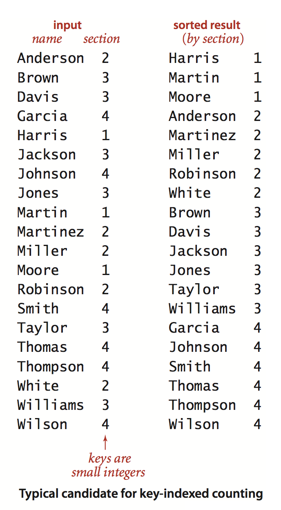
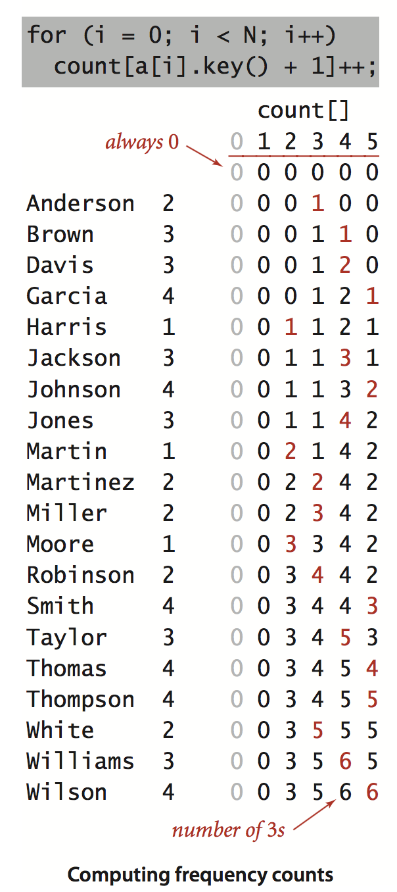
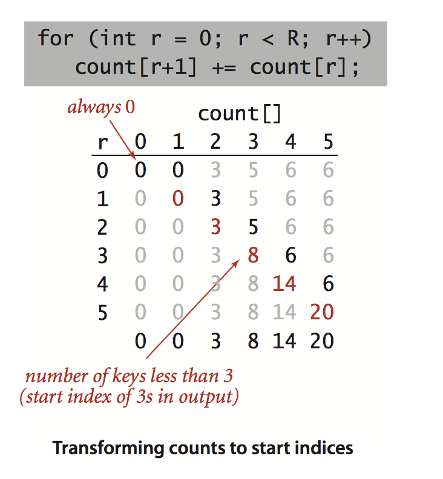
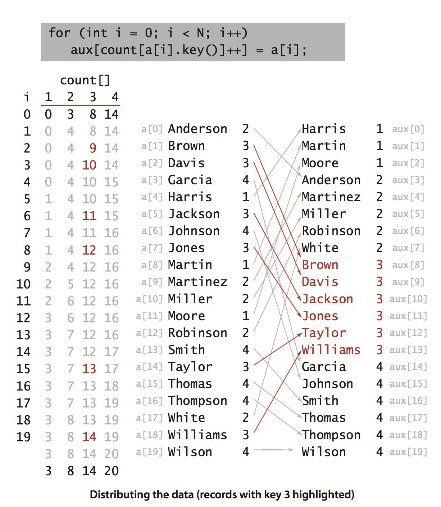
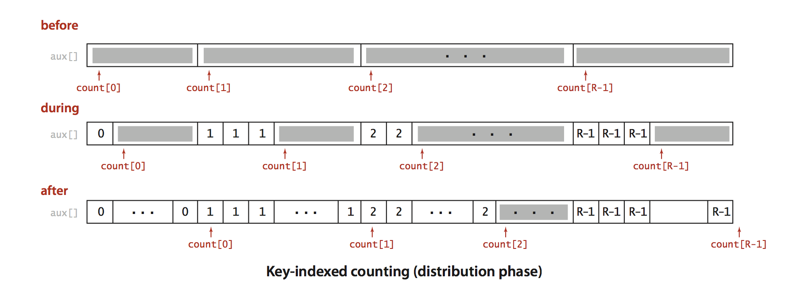
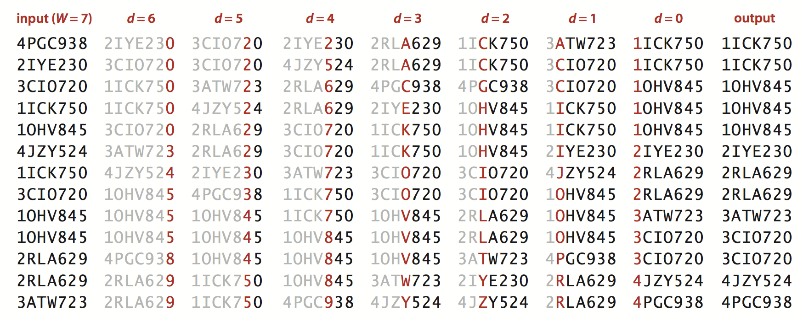
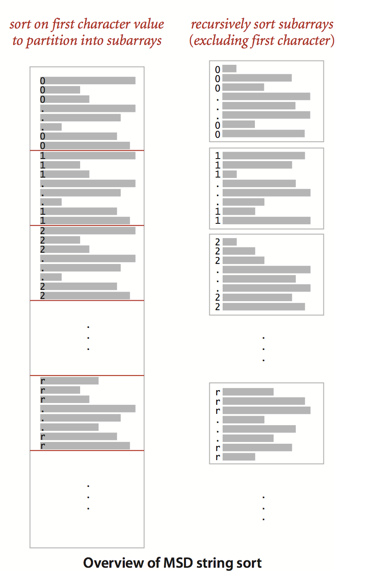
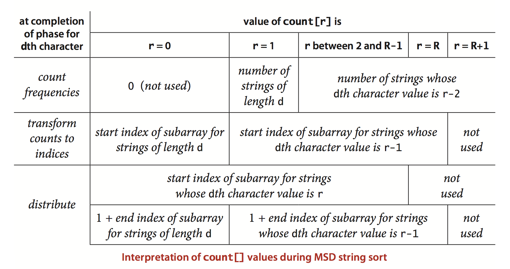
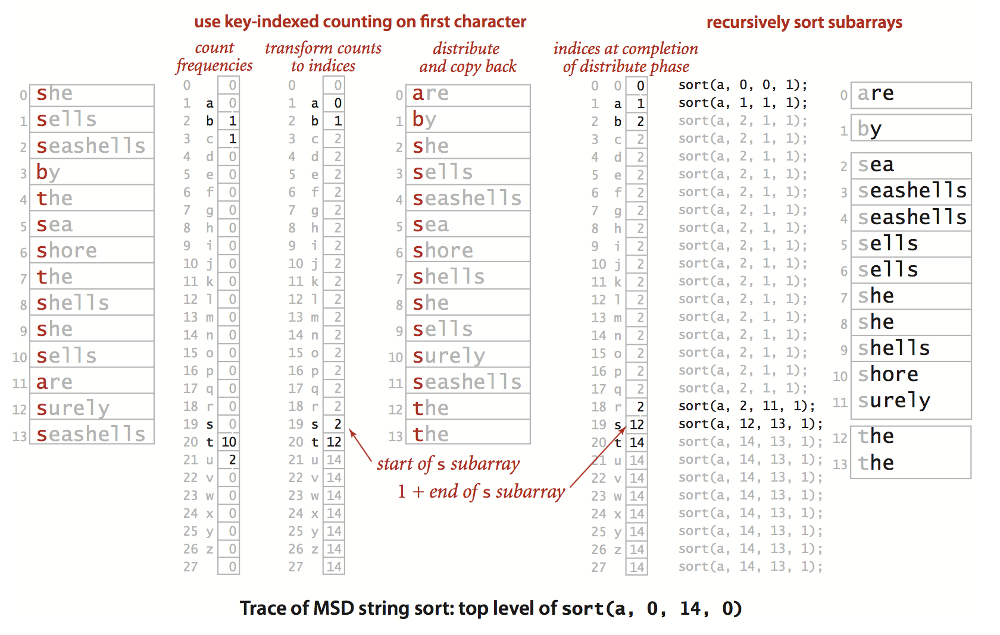
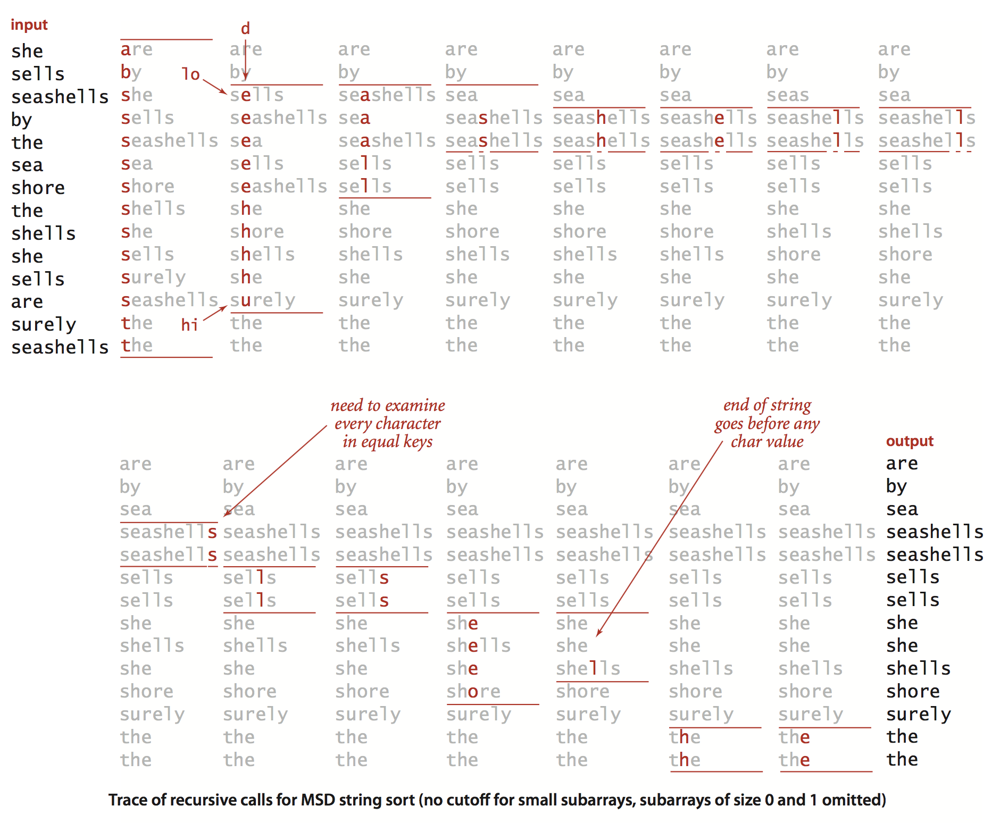

# 字符串排序

在很多排序应用中，决定顺序的键都是字符串，本节我们将利用字符串的特殊性质，学习一些十分高效的字符串排序算法。我们将学习两种完全不同的字符串排序算法：

1. 第一类方法会从右到左检查键中的字符，这种方法一般被称为低位优先(LSD)的字符串排序。这种排序方法适用于键的长度都相同的字符串排序应用，比如手机号、IP地址的排序等等。
2. 第二类方法会从左到右检查键中的字符，首先看的是最高位的字符。这种方法一般被称为高位优先(MSD)的字符串排序。高位优先的字符串排序的吸引人之处在于，它们不一定需要检查所有的输入就能完成排序。


# 一. 键索引计数法

键索引计数法适用于小整数键的简单排序方法。下面以实际的例子来解释这种排序方法的思路。


老师在统计学生的分数的时候可能会遇到以下数据处理问题：学生被分成若干组，组用标号1、2、3等表示，某些情况下希望将全班同学按组分类，因为组的编号是较小的整数，使用键索引计数法来排序比较合适。 如下图所示，数组a[] 中的每个元素都保存了一个名字和一个组号，其中组号在0到R-1之间，代码a[i].key()会返回指定学生的组号。这种方法有四个步骤：




**(1) 频率统计**

第一步就是使用int数组count[] 计算每个键出现的频率。对于数组a[]中的每个元素都使用它的键访问count[]数组中相应的元素并将其加1。如果键为r， 则将count[r+1]加1。下图显示了这个过程：




**(2)将频率转换成索引**

接下来，使用count()来计算每个键在排序结果中的起始索引位置。在上图的示例中，第一组和第二组分别是3个人和5个人。因此第三组的同学在排序结果中的起始位置就是8。一般来说，任意给定的键r的起始索引 等于 所有小于键r的所有键出现的频率和。利用上面的规律很容易将count[]转化为一张用于排序的索引表是很容易的。如下图



**（3）数据分类**

将count() 数组转换成一张索引表之后，将所有元素移动到一个辅助数组aux[]中以进行排序。每个元素在aux[]中的位置是由它的键r在count[r]中对应的值所决定的。移动之后再将count[r]自加。以保证count[r]总是下一个键为r的元素在aux[]中的索引位置。 这样只需要遍历一遍数据即可以获得排序产生的结果，排序过程如下图所示：







> 结论：从上面的排序过程不难看出：这种排序方式的稳定性是可以保证的，键相同的元素会在排序后聚合在一起，并且相对顺序没有改变。 时间复杂度是O(n) 空间复杂度同样是O(n) 因为我们用到了同等大小的辅助数组来保存结果。


**(4)回写**

我们将元素移动到了辅助数组之后完成了排序，最后一步就是将排序结果复制回原数组。


**总结：**

键索引计数法是一种对于小整数键排序非常有效的排序方法。其时间复杂度的结论如下：

> 定理：键索引计数法排序 N个元素，键为0~R-1之间的整数的元素的时间复杂度是O(N), 空间复杂度是O(N)

上面的定理可知，键索引计数法突破了NlogN的排序算法运行时间下限。


算法的实现如下：

```java
public sort(Element[] a, int R){
  	int N = a.length;
  	String[] aux = new String[N];
  	int[] count = new int[R+1];
  	
  	// 计算出现的频率
  	for(int i=0; i<N; i++){
      	count[a[i].key()+1]++;
  	}
  	// 将频率转换成索引
  	for(int r=0; r<R; r++){
      	count[r+1]+=count[r];
  	}
  	// 将元素分类
  	for(int i=0; i<N; i++){
      	aux[count[a[i].key()]++] = a[i];
  	}
  	//回写
  	for(int i=0; i<N; i++){
      	a[i] = aux[i];
  	}
}
```


# 二. 低位优先的字符串排序

对于此算法的学习还是以实际例子为说明：假设现在要统计某一段时间内通过某一个热点交通路口的车辆的车牌号，并对车牌号进行排序，以统计不同地区维度的车辆数量。 车牌号我们知道是数字和字符的组合，但是车牌号的长度都是固定的，所以问题就可以抽象成对于等长字符串的排序。其实对于这类排序的实际场景还有很多，比如对于手机号的排序、IP地址的排序，等等。


这类字符串的排序就可以使用键索引计数法来完成。假设字符串的长度均为W，然后从右到左以每个位置的字符作为键，用键索引计数法将字符串排序W遍，然后就可以得到有序的结果。需要我们注意的是，该算法依赖于键索引计数算法是稳定的。


> 定理：低位优先的字符串排序算法能够稳定的将定长字符串排序。
>
> 证明：前面我们已经说过，键索引计数法是稳定的，在将最后一个字符作为键(稳定的方式)进行排序之后，可以知道任意两个键在数组中的顺序都是正确的。要么因为它们倒数第i个字符不同，算法已经将它们排序了；要么它们的倒数i个字符相同，由于排序的稳定性，它们仍然有序。


LSD实现的算法如下：

```Java
package com.example.algorithm4.string;

/**
 * 低位优先的等长字符串排序
 *
 * @author 惜暮
 * @email chris.lyt@alibaba-inc.com
 * @date 2017/12/9
 */
public class LSD {
    /**
     * 低位优先排序算法
     *
     * @param a 字符串数组
     * @param w 字符串的长度
     */
    public static void sort(String[] a, int w){
        int N = a.length;
        int R = 256;// 字符的ASCII码的范围，数字0~9的ASCII范围是48~57/ 字符A~Z是65~90/ 字符a~z是97~122
        String[] aux = new String[N];

        for(int d=w-1; d>=0; d--) {
            // 根据第d个字符用键索引计数法排序
            int[] count = new int[R+1];// 统计每个字符对应的ASCII出现的次数，count[0]什么都不保存，默认是0
            //统计出现的频率
            for (int i=0; i<N; i++){
                count[a[i].charAt(d)+1] ++;
            }
            // 将频率转换成索引
            for (int r=0; r<R; r++){
                count[r+1] += count[r];// count[r]保存的是比ASCII为r的字符小的字符出现的次数
            }
            // 将元素分类
            for (int i=0; i<N; i++) {
                aux[count[a[i].charAt(d)]++] = a[i];
            }
            // 回写
            for(int i=0; i<N; i++){
                a[i] = aux[i];
            }
        }
    }

    public static void main(String[] args) {
        int a = 'a';
        System.out.println(a);
    }
}
```


将每个元素均为含有W个字符的字符串数组a[]排序，要进行W次键索引计数排序：从右到左，以每个位置的字符为键排序一次。


下图是给出了13个车牌号嘛，并给出了排序的具体过程：




从理论上说，低位优先的字符串排序意义重大，因为其适用于一般应用的线性时间排序算法，无论N有多大，都只遍历W次数据。


> 定理：对于基于R个字符的一系列等长字符串，字符串个数是N，长度是W。低位优先的字符串排序算法需要访问 7WN+3WR次数组，也就是时间复杂度基本为O(N)，空间复杂度也为O(N)。


# 三. 高位优先的字符串排序

前面的低位优先的字符串排序，适合于字符串等长的情况。但是也有很多场景是字符串长度是不等长的，比如任务的名字。我们要实现一个通用的字符串排序算法(字符串长度不等)，我们应该考虑从左到右遍历字符串。我们知道以a开头的字符串应该排在以b开头的字符串前面，等等。实现这种思想的一个很自然的方法就是递归算法， 称为高位优先字符串排序算法。


高位优先字符串排序算法具体思路如下：首先利用键索引计数法将所有字符串按照首字母排序，然后递归的，再将首字母相同的字符串对应的子数组排序(忽略首字母，因为每一类中首字母相同)。 和快速排序一样，高位优先字符串排序算法会将数组切分为能够独立排序的子数组来完成排序任务，但它的切分会为每个首字母得到一个子数组，而不是像快排那样产生固定的两个或则三个切分。如下图所示实例：



##  1. 对字符串末尾的约定

对于不等长的字符串，我们应该特别注意的是到达字符串末尾的情况。合理的做法是将所有字符都已经被键索引计数算法检查过的字符串所在的子数组排在所有子数组的前面，这样就不不需要递归的将该子数组排序，为了简化这两步计算，我们使用了一个接受两个参数的私有方法charAt()来将字符串中字符索引转化为数组索引，当指定的位置超过了字符串的末尾时该方法返回-1，然后将所有返回值加1，得到一个非负的int值并用它作为count[]的索引。 ==这种转换意味着字符串中的每个字符都可能产生R+1种不同的值：0表示字符串的结尾，1表示字符串的第一个字符，2表示字符串的第二个字符，等等。== 因为键索引计数算法本身就需要一个额外的位置，所以使用`int count[] = new int[R+2]` 创建记录统计频率的数组。

## 2. 指定的字母表

高位优先的字符串排序的成本和字母表中的字符数量有很大关系。我们可以很容易修改令排序算法接受一个Alphabet对象作为参数。以改进基于较小的字母表的字符串排序程序的性能。需要改动如下：

- 构造函数中使用alpha对象保存字母表;
- 构造函数中将R设为alpha.R();
- 在charAt()方法中将s.charAt(d)替换为alpha.toIndex(s.charAt(d))。





算法的实现如下：

```Java
package com.example.algorithm4.string;

import edu.princeton.cs.algs4.Insertion;

/**
 * 非等长的高位优先的字符串排序算法。
 *
 * @author 惜暮
 * @email chris.lyt@alibaba-inc.com
 * @date 2017/12/9
 */
public class MSD {

    private static final int R = 256; //字符基数
    private static final int M =15; //小数组的切换阈值
    private static String[] aux;//数据分类的辅助数组

    /**
     * 字符串末尾的约定处理方法。
     *
     * @param s 源字符串
     * @param d 检索字符串的第d位
     * @return
     */
    private static int charAt(String s, int d){
        if(d < s.length()){
            // 检索还不到字符串的末尾，正常返回
            return s.charAt(d);
        } else {
            // 检索到了字符串的末尾，返回-1，表示到了字符换的末尾
            return -1;
        }
    }

    /**
     * 排序
     * @param a 待排序的字符串数组
     */
    private static void sort(String[] a){
        int N = a.length;
        aux = new String[N];
        sort(a, 0, N-1, 0);
    }

    /**
     * 递归进行字符串排序：以第d个字符作为键将a[lo]至a[hi]排序
     * @param a  待排序的字符串数组
     * @param lo 排序的起始下标
     * @param hi 排序的结束下标
     * @param d  键索引计数法的键在字符串中的下标
     */
    private static void sort(String[] a, int lo, int hi, int d){
        // 以第d个字符作为键将a[lo]至a[hi]排序
        if(hi <= lo+M){
            // 当排序的数据量范围很小的时候，直接用暴露排序。
            Insertion.sort(a, lo, hi);
            return;
        }
        int[] count = new int[R+2];//计算频率， 体会这里R+2的精妙之处
        for(int i=lo; i<=hi; i++){
            count[charAt(a[i], d)+2]++;
        }
        //将频率转换成索引
        for(int r=0; r<R+1; r++){
            count[r+1] += count[r];
        }
        // 数据分类
        for(int i=lo; i<=hi; i++){
            aux[count[charAt(a[i], d)]+1] = a[i];
        }
        // 回写
        for(int i=lo; i<=hi; i++){
            a[i] = aux[i-lo];
        }
        // 递归的以每个字符串为键进行排序
        for(int r=0; r<R; r++){
            sort(a, lo+count[r], lo+count[r+1]-1, d+1);
        }
    }
}
```


在将一个字符串数组a[]排序时，首先根据首字母用键索引计数法进行排序，然后递归地根据子数组中的字符串的首字母将子数组排序。


上面算法的简洁令人刮目相看，它隐藏了很多复杂的计算，我们有必要花时间仔细的研究下面实例的调用轨迹，理解这个算法的精妙之处：







上图轨迹中，小数组的插入排序阈值（M）是0，因此我们可以看到完整的排序过程。例子中字符串来自Alphabet.LOWERCASE, 其R=26。对于高位优先排序算法， 字母表的数量是很重要的一个点，如果使用不当，其时间和空间消耗难以想象。


## 3.小型子数组(高位优先字符串排序第一个陷阱)

高位优先的字符串排序的基本思想是非常有效的：在一般应用中，只需要检查若干个字符就能完成所有字符串的排序。换句话说，**这种方法能够快速地将需要排序的数组切分为较小的数组。** 这种切分是一把双刃剑：**我们肯定会处理大量的微型数组，因此必须快速的处理它们。** ==小型子数组的处理速度对高位优先的字符串排序性能是至关重要的。== 


## 4. 等键值(高位优先字符串排序第二个陷阱)


## 5. 额外空间(高位优先字符串排序第三个陷阱)


## 6. 随机字符串模型


## 7. 性能


# 四. 三向字符串快速排序


# 五. 字符串排序算法的选择


