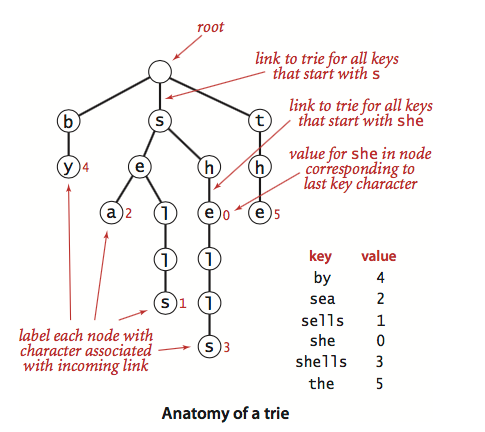
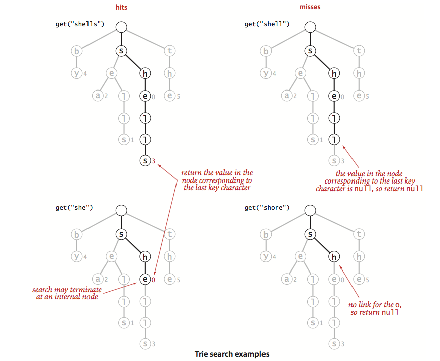
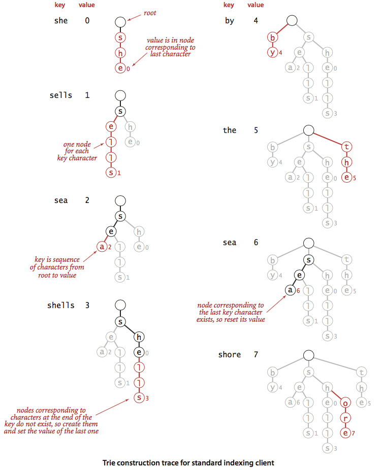
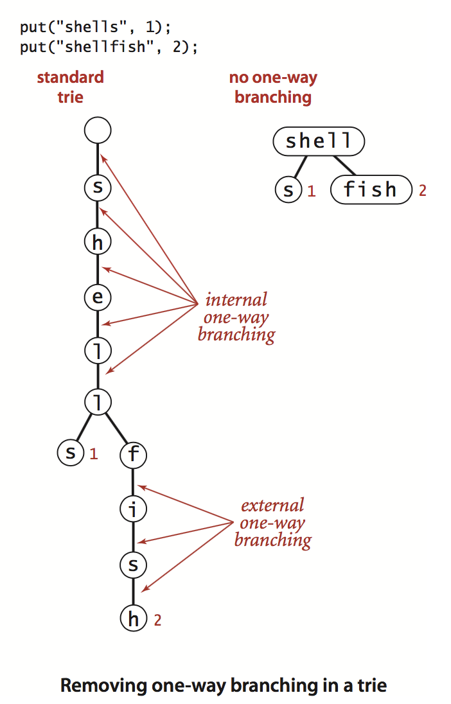
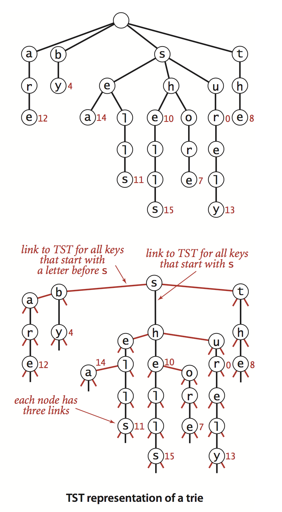

# 单词查找树

和排序一样，我们也可以利用字符串的特性，开发比通用查找算法更加有效的查找算法，以便用于以字符串作为查找的键的一般应用程序。


对于单词查找树(字典树)在一般应用场景中(甚至对于巨型的符号表)都能够获得以下性能：

- 查找命中所需要的时间与被查找的键的长度成正比
- 查找未命中只需要检查若干个字符


仔细想想，这个性能是相当惊人的。更重要的是我们可以扩展符号表的API，添加基于字符的用于处理字符串类型的键的操作。

**以字符串为键的符号表的API**

|      `public class StringST<Value>`      |                               |
| :--------------------------------------: | :---------------------------: |
|                StringST()                |            创建一个符号表            |
|    void put(String  key, Value value)    | 向表中插入键值对，如果value为null，则删除键key |
|          Value get(String Key)           |   键Key所对应的值(如果键不存在就返回null)    |
|         void delete(String key)          |             删除键值对             |
|       boolean contains(String key)       |         表中是否保存着key的值          |
|            boolean isEmpty()             |            符号表是否为空            |
|     String longestPrefixOf(String s)     |           s的前缀中最长的键           |
| `Iterable<String> keysWithPrefix(String s)` |           所有以s为前缀的键           |
| `Iterable<String> keysThatMatch(String s)` |   所有和s匹配的键(其中`.`能够匹配任意字符)    |
|                int size()                |            键值对的数量             |
|        ` Iterable<String> keys()`        |          符号表中的全部键值对           |

​                                  

这份API与ST符号表不同点在于：

-  将泛型的key变换成了具体的String
-  添加了三个方法：longestPrefixOf、keysWithPrefix、keysThatMatch

本节任然遵守约定：不接受重复的键值或则空键，值不能为null。


从对字符串的排序算法我们可以看到指定字符串的字母表常常十分重要。对于小型字母表的简单高效的实现不适用于大型字母表，这是因为后者消耗空间太多。下面以具体的实例来讲解一下新增的三个函数的具体含义:假设现在有key：she、sells、sea、shells、by、the、sea、shore这些键。

（1）longestPrefixOf接受一个字符串参数并返回符号表中该字符串的前缀中最长的键。比如对于longestPrefixOf("shell")返回的是she、longestPrefixOf("shellsort")返回的是shells。

（2）keysWithPrefix()接受一个字符串并返回符号表中所有以该字符串作为前缀的键。比如：keysWithPrefix("she")结果是she和shells，keysWithPrefix("se")结果是sells和sea。

（3）keysThatMatch()接受一个字符串参数并返回符号表中该字符串匹配的键。其中参数字符串中的点(".")可以匹配任何字符。比如：keysThatMatch(".he")结果是she和the；keysThatMatch("s..")结果是she和sea；


在理解了这些基本方法之后，下面就是具体的实现和应用了。 

# 一.单词查找树

本节主要是学习单词查找树这种数据结构。它由字符串键中的所有字符构造而成，允许使用被查找键中的字符进行查找。下面首先简单描述单词查找树的性质，包括插入和查找算法，然后仔细学习其数据表示方法和Java实现。

## 1.基本性质

和各种查找树一样，单词查找树也是由链接的结点组成的数据结构，这些链接可能为空，也·可能指向其余的结点。**每个结点都只可能有一个指向它的结点，被称为它的父节点**（有一个结点除外，即根结点，没有任何结点指向它）。每个结点都含有R个链接，其中R为字母表的大小。字典查找树中一般都含有大量的空链接，因此在绘制一颗字典查找树时一般会忽略空链接。尽管链接指向的是结点，但是也可以看做链接指向的是另一颗单词查找树，它的根节点就是被指向的结点。每条链接都指向一个字符，所以可以用链接对应的字符标记被指向的结点。每个结点都有一个值，可以·是空，也可以是符号表中某个键所关联的值。 简单来说，**我们将每个键关联的值保存在该键的最后一个字符所对应的结点上。值为空的结点在符号表中没有对应的键，它们的存在仅仅为了简化单词查找树中的查找操作。**


一颗单词查找树的实例如下：



## 2.单词查找树中的查找操作

整个查找过程比较简单：以被查找的字符串键为导向，从根节点开始，首先经过的是键的首字母对应的链接；在下一个节点中沿着第二个字符所对应的链接继续前进；在第二个节点中沿着第三个字符所对应的链接向前，如此继续直到到达了键的最后一个字母所对应的节点，或则是遇到了一个空链接。这时可能有以下三种情况：

- 键的尾字符对应的节点的值非空，这是一次命中的查找，键的值就是尾字符对应的节点中保存的值，如下图查找shells和she的实例
- 键的尾字符对应的节点的值为空，这是一次未命中的查找，符号表中不存在被查找的键，如下图查找shell实例
- 查找结束于一条空链接，也是一次未命中的查找，如下实例查找shore



执行查找的操作就是在单词查找树中从根节点开始检查某条路径上的所有节点。

## 3.单词查找树中的插入操作

和二叉查找树类似，在插入之前要进行一次查找：在字典树中意味着在字符串键的末尾字符表示字典树的一个结点或则一个空链接。因此有以下两种情况：

- 在到达尾结点之前就碰到了一个空链接。表示不存在该键的结点，需要我们为该字符串键创建路径并保存键的值在尾字符指向的结点。
- 在遇到空字符之前就到达了键的尾字符。这时只需要将要插入的值更新到对应的节点上就OK。


在所有情况下都会检查键中字符是否存在，如下例我们在处理输入she、sells、sea、shells、by、the、sea、shore时构造的字典树：



## 4. 节点的表示

对于结点的表示主要是对于空链接的处理，也就是在数据结构中是否显示的表示空链接。如果我们已经制定了字母表，也就是制定了R的值(如果字符串均由小写字母组成，那么R=26)。我们可以利用数组存储字典树的每一层。这种基于含有R字符的字母表哦的单词查找树称为R向单词查找树。

## 5. 大小

对于字典树的大小的实现有几种方案：

- 即时实现：用一个实例变量N保存键的数量。(JDK 里面很多这种实现)
- 更加即时的实现：用结点的实例变量保存子单词查找树中的键的数量，在递归地put()和delete()方法调用之后更新它们。
- 延时递归实现：遍历字典树的所有节点并统计所有非空值得节点总数。

一般我们都是使用即时实现的方式，对于延时递归实现的方式有学习的价值，但是实际生产中很少使用，因为非常消耗性能。

## 6. 查找所有的键


## 7. 通配符匹配


## 8. 最长前缀


## 9.删除操作


## 10. 字母表


这里直接给出上诉所有的算法的实现：

```java
package com.example.algorithm4.string;

import java.util.Iterator;

import edu.princeton.cs.algs4.Queue;
import edu.princeton.cs.algs4.StdIn;
import edu.princeton.cs.algs4.StdOut;

/**
 * R向单词字典树的实现
 *
 * @author 惜暮
 * @email chris.lyt@alibaba-inc.com
 * @date 2017/12/11
 */
public class TrieST<Value> {
    /**
     * 字符表的大小
     */
    private static final int R = 256;
    private Node root;
    /**
     * 字典树的大小
     */
    private int n;

    public TrieST() {
    }

    public Value get(String key) {
        if (key == null) {
            throw new IllegalArgumentException("argument to get() is null");
        } else {
            Node x = this.get(this.root, key, 0);
            return x == null ? null : (Value)x.val;
        }
    }

    public boolean contains(String key) {
        if (key == null) {
            throw new IllegalArgumentException("argument to contains() is null");
        } else {
            return this.get(key) != null;
        }
    }

    /**
     * 返回以x作为根节点的子单词查找树中与key相关联的值
     * @param x 查询的根节点
     * @param key 键值
     * @param d 字符串键的第d个字符，也就是递归地深度
     * @return
     */
    private Node get(Node x, String key, int d) {
        if (x == null) {
            return null;
        } else if (d == key.length()) {
            return x;
        } else {
            // 找到第d个字符所对应的子单词查询树
            char c = key.charAt(d);
            return this.get(x.next[c], key, d + 1);
        }
    }

    public void put(String key, Value val) {
        if (key == null) {
            throw new IllegalArgumentException("first argument to put() is null");
        } else {
            if (val == null) {
                this.delete(key);
            } else {
                this.root = this.put(this.root, key, val, 0);
            }

        }
    }

    /**
     * 如果key存在于以x为根节点的子单词查找树中则更新与它相关联的值。
     *
     * @param x 节点
     * @param key 键
     * @param val 值
     * @param d 当前插入查询的节点的深度
     * @return
     */
    private Node put(Node x, String key, Value val, int d) {
        if (x == null) {
            x = new Node();
        }

        if (d == key.length()) {
            if (x.val == null) {
                ++this.n;
            }

            x.val = val;
            return x;
        } else {
            char c = key.charAt(d);
            x.next[c] = this.put(x.next[c], key, val, d + 1);
            return x;
        }
    }

    public int size() {
        return this.n;
    }

    public boolean isEmpty() {
        return this.size() == 0;
    }

    public Iterable<String> keys() {
        return this.keysWithPrefix("");
    }

    public Iterable<String> keysWithPrefix(String prefix) {
        Queue<String> results = new Queue();
        Node x = this.get(this.root, prefix, 0);
        this.collect(x, new StringBuilder(prefix), results);
        return results;
    }

    private void collect(Node x, StringBuilder prefix, Queue<String> results) {
        if (x != null) {
            if (x.val != null) {
                results.enqueue(prefix.toString());
            }

            for(char c = 0; c < 256; ++c) {
                prefix.append(c);
                this.collect(x.next[c], prefix, results);
                prefix.deleteCharAt(prefix.length() - 1);
            }

        }
    }

    public Iterable<String> keysThatMatch(String pattern) {
        Queue<String> results = new Queue();
        this.collect(this.root, new StringBuilder(), pattern, results);
        return results;
    }

    private void collect(Node x, StringBuilder prefix, String pattern, Queue<String> results) {
        if (x != null) {
            int d = prefix.length();
            if (d == pattern.length() && x.val != null) {
                results.enqueue(prefix.toString());
            }

            if (d != pattern.length()) {
                char c = pattern.charAt(d);
                if (c == '.') {
                    for(char ch = 0; ch < 256; ++ch) {
                        prefix.append(ch);
                        this.collect(x.next[ch], prefix, pattern, results);
                        prefix.deleteCharAt(prefix.length() - 1);
                    }
                } else {
                    prefix.append(c);
                    this.collect(x.next[c], prefix, pattern, results);
                    prefix.deleteCharAt(prefix.length() - 1);
                }

            }
        }
    }

    public String longestPrefixOf(String query) {
        if (query == null) {
            throw new IllegalArgumentException("argument to longestPrefixOf() is null");
        } else {
            int length = this.longestPrefixOf(this.root, query, 0, -1);
            return length == -1 ? null : query.substring(0, length);
        }
    }

    private int longestPrefixOf(Node x, String query, int d, int length) {
        if (x == null) {
            return length;
        } else {
            if (x.val != null) {
                length = d;
            }

            if (d == query.length()) {
                return length;
            } else {
                char c = query.charAt(d);
                return this.longestPrefixOf(x.next[c], query, d + 1, length);
            }
        }
    }

    public void delete(String key) {
        if (key == null) {
            throw new IllegalArgumentException("argument to delete() is null");
        } else {
            this.root = this.delete(this.root, key, 0);
        }
    }

    private Node delete(Node x, String key, int d) {
        if (x == null) {
            return null;
        } else {
            if (d == key.length()) {
                if (x.val != null) {
                    --this.n;
                }

                x.val = null;
            } else {
                char c = key.charAt(d);
                x.next[c] = this.delete(x.next[c], key, d + 1);
            }

            if (x.val != null) {
                return x;
            } else {
                for(int c = 0; c < 256; ++c) {
                    if (x.next[c] != null) {
                        return x;
                    }
                }

                return null;
            }
        }
    }

    public static void main(String[] args) {
        TrieST<Integer> st = new TrieST();

        String s;
        for(int i = 0; !StdIn.isEmpty(); ++i) {
            s = StdIn.readString();
            st.put(s, i);
        }

        Iterator i$;
        if (st.size() < 100) {
            StdOut.println("keys(\"\"):");
            i$ = st.keys().iterator();

            while(i$.hasNext()) {
                s = (String)i$.next();
                StdOut.println(s + " " + st.get(s));
            }

            StdOut.println();
        }

        StdOut.println("longestPrefixOf(\"shellsort\"):");
        StdOut.println(st.longestPrefixOf("shellsort"));
        StdOut.println();
        StdOut.println("longestPrefixOf(\"quicksort\"):");
        StdOut.println(st.longestPrefixOf("quicksort"));
        StdOut.println();
        StdOut.println("keysWithPrefix(\"shor\"):");
        i$ = st.keysWithPrefix("shor").iterator();

        while(i$.hasNext()) {
            s = (String)i$.next();
            StdOut.println(s);
        }

        StdOut.println();
        StdOut.println("keysThatMatch(\".he.l.\"):");
        i$ = st.keysThatMatch(".he.l.").iterator();

        while(i$.hasNext()) {
            s = (String)i$.next();
            StdOut.println(s);
        }

    }

    private static class Node {
        private Object val;
        private Node[] next;

        private Node() {
            this.next = new Node[256];
        }
    }
}
```


# 二. 单词查找树的性质

下面主要分析单词查找树的时间和空间复杂度。

> 单词查找树的链表结构和键的插入或则删除顺序无关：对任意给定的一组键，其字典树都是唯一的。


## 1. 最坏情况下查找和插入操作的时间界限

> 定理：在单词查找树中查找一个键或则插入一个键，访问数组的次数最多是键长度加1。

也就是单词查找树的时间复杂度和数据量无关，只与键的长度有关。


## 2. 查找未命中的预期时间界限

从字典树的特性可知，很大可能情况下我们只需要访问几个节点就可以判断键是否命中。

> 定理：字母表的大小为R，在一颗由N 个随机数构建的字典树中，未命中查找平均所需检查的节点数量是 logR(N)

也就是查找未命中的成本与键的长度无关。


## 3.空间

一颗单词查找树占用的内存是多少？理解这个至关重要。

> 定理：假设字母表大小是R，总结点数量是N；字典树中链接总数在RN到到RNw之间，其中w是键的平均长度。

下面给出一些经验结论：

- 当所有键均较短时，链接的总数接近RN
- 当所有键均较长时，链接的总数接近RNw
- 因此缩小w能大大减小空间。

## 4. 单向分支

长键在字典树中占用大量的空间的主要原因在于树的长键通常有一条长长的尾巴，其中每个节点都只含有一条指向下一个节点的链接，这样就会造成大量的空间的浪费。

字典树里面也可能存在大量的单向分支，比如：两个长键可能只有最后一个字符不同，下图给出一个示例：



# 三. 三向单词查找树

为了避免R向单词查找树过度消耗空间(每一层字符串都需要完整的字母表)，我们来学习另外一种数据表示方法：三向单词查找树(TST)。


三向单词查找树的构造过程如下：在查找树中每个结点含有一个字符、三条链接和一个值。这三条链接分别链接着小于当前字符、等于当前字符和大于当前字符的所有键。 在R向单词查找树中，树的每个结点含有R条链接，每个非空的链接的索引隐式的表达了她对应的字符，但是在等价的三向单词查找树中字符是显示的保存在结点中的，只有沿着结点中间字符相等的链接前进时才能找到具体的键。


三向单词查找树实现查找和插入比较简单。1）查找时：首先比较键的首字母和根结点的字母，如果键的首字母较小就选择左链接；如果键的首字母较大就选择右链接；如果相等就选择中链接。按照这个算法递归查找，如果遇到了一个空链接或则键结束时结点的值为空说明没有命中；如果键结束时结点的值非空则命中查找。 2）插入时：首先按照查找算法查找，然后在树的末尾补全所有的结点。


下图显示了一个单词查找树对应的三向单词查找树的实例：



具体的实现算法如下：

```java
package com.example.algorithm4.string;

/**
 * 三向单词查找树的实现
 *
 * @author 惜暮
 * @email chris.lyt@alibaba-inc.com
 * @date 2017/12/17
 */
public class TST<Value> {
    /**
     * 根节点
     */
    private Node root;

    /**
     * 树的结点，可见域仅仅在于类内部
     */
    private class Node{
        /**
         * 当前结点代表的字符
         */
        char c;
        /**
         * 当前结点的左、右、中链接
         */
        Node left, mid, right;
        /**
         * 当前结点代表的键的值
         */
        Value value;
    }

    public Value get(String key){
        Node node = get(root, key, 0);
        if (node == null){
            return null;
        }else {
            return node.value;
        }
    }

    /**
     *
     * @param x
     * @param key
     * @param d
     * @return 如果key为null返回null ，否则返回查询到的结点。
     */
    private Node get(Node x, String key, int d){
        if(x == null){
            return null;
        }
        char c = key.charAt(d);
        if(c < x.c){
            return get(x.left, key, d);
        } else if (c > x.c){
            return get(x.right, key, d);
        } else if (d < key.length()-1){
            return get(x.mid, key, d+1);
        } else {
            return x;
        }
    }

    public void put(String key, Value val) {
        root = put(root, key, val, 0);
    }


    private Node put(Node x, String key, Value val, int d) {
        char c = key.charAt(d);
        if (x == null) {
           x = new Node();
           x.c = c;
        }
        if (c < x.c) {
           x.left  = put(x.left,  key, val, d);
        } else if (c > x.c) {
           x.right = put(x.right, key, val, d);
        } else if (d < key.length() - 1){
           x.mid   = put(x.mid, key, val, d+1);
        } else {
           x.value = val;
        }
        return x;
    }
}
```

# 四. 三向单词查找树的性质

从三向单词查找树的实现我们可以知道，三向单词查找树其实就是R向单词查找树的紧凑实现。但是两则的性质完全不同。三向查找树的树结构将取决于单词插入的顺序。

## 1. 空间

TST最重要的特点就是每个结点都只含有三个链接，因此TST所需要的空间远小于对应的单词查找树。

> 定理：N个平均长度为w的字符串构造的TST中总链接数在3N到3NW之间

实际上TST使用内存空间会远远低于每个字符三个链接得到的上界，因为有相同前缀的键会共享树中的高层结点。

## 2. 查找成本

TST的查找成本为单词查找树的查找成本乘以遍历每个结点的二叉查找树所需要的成本。


## 3.删除操作

三向单词查找树的实现相对比较复杂，在单词查找树中只需要将键对应的字符对应的元素置为null即可。但是在TST中需要按照二叉查找树中删除节点的方式来删除与该字符对应的结点。

## 4. 混合三向单词查找树

其实就是单词查找树和TST的混合使用，在前面一个或则两个字母采用单词查找树表示，后面的结点采用TST表示。这种方式非常适合于首字母分布均匀的场景，比如·手机号等等。


# 五. 应该使用字符串符号表的哪种实现

前面我们已经学习了很多种查找算法了，下面针对各个算法时空复杂度和适用场景做一个总结：


下面针对大小为R的字母表构造N个字符串(平均长度为w)场景：

| 算法(数据结构)   | 未命中查找检查的字符数量 | 内存使用               | 优点(适用场景)             |
| ---------- | ------------ | ------------------ | -------------------- |
| 二叉查找树(BST) | c1(lgN)^2    | 64N                | 适合随机排列的键             |
| 红黑树        | c2(lgN)^2    | 64N                | 性能保证(数组实现的最小堆实现红黑树) |
| 线性探测法      | w            | 32N~128N           | 缓存散列值                |
| 字典树查找(R向)  | logR(N)      | (8R+56)N~(8R+56)Nw | 适合于较短的键和较小的字母表       |
| 字典树查找(3向)  | 1.391lg(N)   | 64N~64Nw           | 适合于非随机的键             |


