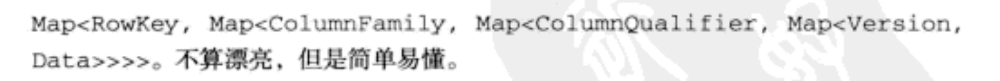

# 【Hbase】简述
#框架/Hbase

# Hbase构成
> Hbase由多个灵活的部件构成  

（1）HBase在HDFS上存储
（2）使用Zookeeper管理集群状态
（3）大多数部署用到了MapReduce

# HBase概念
HBase是一种数据库：稀疏的、分布式的、持久化的、多维有序映射的数据库。它基于行健(rowkey)、列键(columnkey)和时间戳(timestamp)建立索引。

Hbase属于：
（1）键值存储
（2）面向列的数据库
（3）存储多时间戳版本映射的数据库
（4）从根本上说是一个可以随机访问的存储和检索数据平台。

HBase不用SQL也就不存在关系约束，不允许跨行事务，承诺强一致性。

适用于结构简单的大数据量。

启动Hbase:  `./start-hbase.sh` 
启动hbase-shell `./hbase shell`

Hbase管理控制台：http://localhost:16010/

# Hbase的物理数据模型和逻辑数据模型
API操作的是逻辑数据模型
理解物理数据模型方便进行优化

HBase中的表也是按照行 和 列 来组织的，不过Hbase的列组成列族(column family)

HBase用坐标来定位表中的数据，第一个坐标是行键，第二个坐标是列族，第三个坐标是列限定符。这三个坐标确定了单元(cell)的位置。也就是::[rowkey, column family, colimn qualifier]::确定一个单元的数据。

数据操作：Get读、Put写、Delete删除、Scan扫描、Increment递增。 没有update，update其实就是Put。

## 1. 数据模型概括
* 表
* 行
* 列族
* 列限定符
* 单元
* 时间版本(每个单元默认保存3个时间版本的值)

Hbase使用四维坐标系统：行、 列族、 列限定符、时间版本

HBase设计上没有严格形态的数据，属于半结构化数据，这影响了物理模型的设计。

## 2. 逻辑模型：有序映射的映射

## 3. 物理模型：面向列族

# HBase的模式设计(schema)

::行键的设计至关重要，好的行键设计可以不用扫描表::

扫描器缓存
使用过滤器
- - - -
- - - -
# 分布式的HBase、HDFS和MapReduce
> 1）分布式存储系统的HBase  
> 2）何时使用MapReduce而不是键值API  
> 3）MapReduce概念和工作流程  
> 4）如何为HBase编写MapReduce应用  
> 5）如何在HBase上使用MapReduce完成map侧联结  

MapReduce提供分布式计算能力、HDFS提供分布式存储。MapReduce用于高效的离线处理大量数据。

MapReduce = Map(计算) + Reduce (聚合)  适合分布式海量数据批处理问题；

还有另外一种是：分布式实时流数据处理。

- - - -
- - - -

# HBase 表设计
## 模式设计应该考虑的内容
（1）表应该有多少个列族
（2）列族使用什么数据
（3）每个列族应该有多少列
（4）列名应该是什么？尽管建表不需要知道，但是读写数据还是要知道的。
（5）单元存放什么数据
（6）每个单元存放多少个时间版本
（7）::行健结构是什么？应该包括什么信息。::

