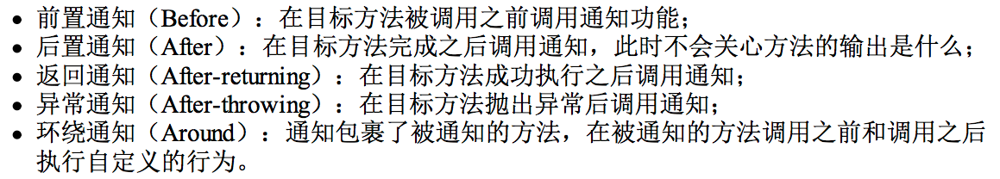

#  spring-aop概念

#框架/spring/笔记

> AOP应用场景：日志、安全、事务、缓存、性能评估；  
> 公共特点：应用中几乎所有的地方都需要，但是又不想显示的调用它们，进行解耦，实现模块化。将业务逻辑与公共调用部分隔离。  

（1）在bean初始化的时候，看是否有配置AOP，

（2）如果有配置AOP， 就考虑植入切面逻辑(通过代理实现织入切面逻辑)，然后将bean对应的对象配置成代理类，那么实际运行的时候，就是运行的代理类

# question
（1）AOP注解怎么和动态代理结合起来的
（2）

> bean的扫描和解析——>生成所有的 BeanDefinition  
> （ConfigurationClassPostProcessor#postProcessBeanDefinitionRegistry() 扫描了所有的bean）

—->根据beanDefinition来进行Bean的一系列实例化、注入、初始化
—-->

# AOP中重要概念
（1）通知advice：有五种通知。

（2）连接点joinpoint：就是spring允许你通知（Advice）的所有地方，基本每个方法的前、后（两者都有也行），或抛出异常是时都可以是连接点，spring只支持方法连接点。（连接点是一个虚的概念，可简单理解为所有可作为切入点的集合。）

（3） 切点pointcut：上面说的连接点的基础上，来定义切入点，你的一个类里，有15个方法，那就有十几个连接点了对吧，但是你并不想在所有方法附件都使用通知，你只是想让其中几个，在调用这几个方法之前、之后或者抛出异常时干点什么，那么就用切点来定义这几个方法，让::切点来筛选连接点::，选中那几个你想要的方法。

（4）Advisor是Pointcut和Advice的配置器，它包括Pointcut和Advice，是将Advice注入程序中Pointcut位置的代码

# AOP中的术语
> AOP的实现有两个流行的框架：Spring AOP和AspectJ, 两者有一些区别与联系  

Spring AOP：
		1. spring aop的切入点支持有限，而且对于static方法和final方法都无法支持aop（因为此类方法无法生成代理类）
		2. spring aop的目的是基于Spring bean之上将切面模块化，也就是只支持Spring ioc容器管理的bean，也就是与Spring IOC强依赖。对于普通的java 对象不支持。
		3. Spring AOP的支持局限于方法的拦截
		4. Spring对AOP的支持：前面三种都是基于代理实现的AOP
			1. 基于代理实现的Spring AOP
			2. 纯POJO切面
			3. @AspectJ 注解驱动的切面
			4. 注入式AspectJ切面(依赖于AspectJ， 也就是在Spring中加入了AspectJ)

AspectJ：一套不依赖于Spring的独立的AOP实现
		1. 不依赖Spring 容器， 可以作用于普通的Java对象， 也就是可以用于非Spring的项目。
		2. 支持粒度更加细的构造器和字段属性拦截。

最重要的是哪个概念：
1. 切面：aspect， 比如安全就可以定义成一个切面，日志也可以定义成一个切面。切面=切点+通知
2. 切点：pointcut，切点定义了切面的 “何处”执行，即用于准确定位应该在什么地方应用切面的通知。
3. 通知：advice，通知定义了切面是“什么”、切面的主要工作以及切面“何时”使用 ， 常用的有5种通知：
  1. 前置通知：Before，目标方法调用之前执行
  2. 后置通知：After，目标方法调用之后执行， 在After-returning或则After-throwing之后调用
  3. 返回通知：After-returning
  4. 异常通知：After-throwing
  5. 环绕通知：Around： 环绕目标方法执行前后

4. 连接点joinpoint：连接点是连接多个切点的。连接点连接多个切点。

## 1. 通知
切面的工作被称为通知，通知定义了切面是什么以及何时使用。

spring的切面可以应用5种类型的通知：

   

