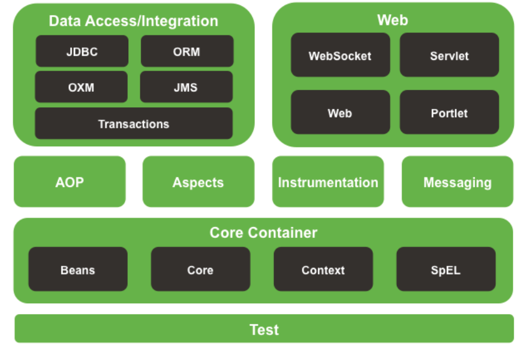

# 【1-Spring-reference】常用注解总结
#框架/spring/注解

Spring的组成：

- [ ] [x] core
# Spring Core Tech

## 核心注解
@Required ：表示某一个类必须被装配，如果没有装配进去(为null)，就会抛出异常

@Autowired：根据类型注入；
	@Primary：当存在多个相同类型的bean，加了此注解的优先被注入。
	 @Qualifier：设置bean的Name

@Resource：根据bean的Name进行注入。

@PostConstruct ：被@PostConstruct修饰的方法会在构造函数之后，init()方法之前运行。

@PreDestroy：被@PreConstruct修饰的方法会在destroy()方法之后运行，在Servlet被彻底卸载之前

- - - -
- [ ] [x] 17 . Transaction事务管理

# Spring的事务管理
> 事务管理是基于数据源之上的，也就是事务管理管理的实际上是数据源。而我们对数据源的访问其实就是对DB的访问。  

1）编程式事务管理：耦合在代码里面。
2）声明式事务管理：XML或则注解，基于动态代理的AOP切面实现。

在SpringBoot中使用事务管理，首先在Application类上使用@EnableTransactionManagement注解。 该注解事务管理，等同于xml配置方式的 <tx:annotation-driven />

然后在方法或则类上使用@Transactional注解，代表启用事务管理。

- - - -
- [ ] [x] Testing

# Testing
* 单元测试：验证编码单元正确性，比如Java里面分层中各个独立层的正确性，某一层依赖的其余层全部Mock。单元测试主要关注每个具体单元模块内部的逻辑结构和功能是否正确。
* 集成测试：被测对象是分层间(单元间)的组合，这里，不同模块往往是分配给不同的人员开发。集成测试主要关注不同单元模块之间的接口和配合。

1. 单元测试其实就是单层测试，依赖层Mock掉。
2. 集成测试就是各个层之间真实依赖测试，数据访问也全部真实，但是要加事务的回滚。

## Testing提供的注解
@WebAppConfiguration ：描述Spring容器加载ApplicationContext使用WebApplicationContext，用于Controller层的测试。(MockMvc对象测试Controller)

@ContextConfiguration ：加载Spring容器的配置文件，可以是XML文件也可以是Java config文件。

@ActiveProfiles： 描述bean容器的环境配置，

@TestPropertySource：为测试添加properties属性，其优先级高于系统的properties也高于@PropertySource注解添加的属性。

@commit ：表示对于事务管理的方法，在执行完Test方法之后，属于数据访问层的访问直接提交的数据库，不进行回滚。等价于@Rollback(false)

@Rollback：事务管理下，Test Method 在访问完数据层之后都回滚。

@BeforeTransaction：加在方法上面的注解，表示在一个通过@Transactional 管理的事务方法在执行之前执行的方法。

@AfterTransaction：加在方法上面的注解，表示在一个通过@Transactional 管理的事务方法在执行之后执行的方法。

@sql ：用于注释测试类或测试方法。以便在集成测试期间配置针对给定数据库执行的SQL脚本。

@Timed：作用于方法级别，表示测试方法的执行时间必须在指定时间之内结束(毫秒)，如果超过了时间就会失败。

@Repeat：注解表示测试的方法要重复执行多少次。

